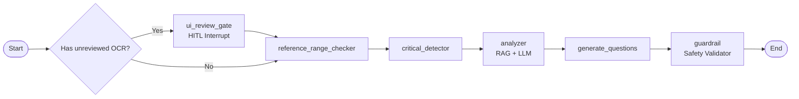
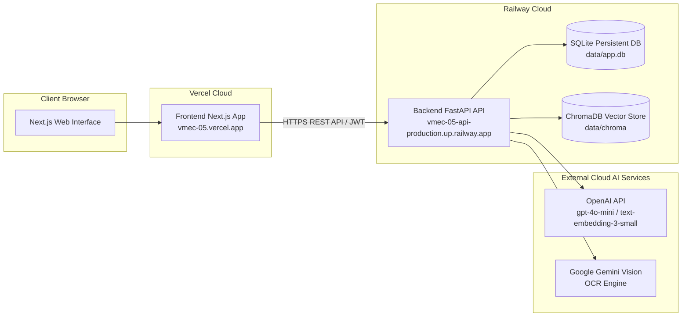

# Architecture Document

## System Overview

Hệ thống AI Agent hỗ trợ giải thích kết quả xét nghiệm ngoại trú bằng ngôn ngữ dễ hiểu cho bệnh nhân (VMEC-05). Hệ thống kết hợp phân loại khoảng tham chiếu và phát hiện giá trị nguy kịch tất định (Deterministic Rule-based), tra cứu tri thức y khoa có kiểm chứng (RAG từ ChromaDB), sinh giải thích thân thiện (LLM) và kiểm duyệt an toàn y tế nghiêm ngặt (Medical Guardrails).

## Architecture Diagram

```mermaid
flowchart LR

    %% =========================
    %% USER / FRONTEND
    %% =========================
    subgraph FE["Frontend — Next.js"]
        USER["Patient / Guest"]
        INPUT["Lab Result Input<br/>Manual / JSON / Image"]
        REVIEW["OCR Review UI<br/>Confirm extracted values"]
        ASSIST["Hybrid Assistant<br/>Patient / Guest"]
        RESULT["Result Screen<br/>Status · Explanation<br/>Critical Warning · Disclaimer"]
    end

    %% =========================
    %% API
    %% =========================
    subgraph API["Backend — FastAPI"]
        ENDPOINT["Analysis API"]
        ORCH["Orchestrator API"]
        OCR["OCR / Vision Service"]
        OCR_GATE["OCR Review Gate"]
        SCHEMA["Standard Lab Result Schema"]
    end

    %% =========================
    %% LANGGRAPH
    %% =========================
    subgraph AGENT["AI Workflow — LangGraph"]
        REF["Reference Range Checker<br/>Deterministic<br/>LOW / NORMAL / HIGH"]

        CRIT["Critical Detector<br/>Deterministic<br/>CRITICAL_LOW / CRITICAL_HIGH"]

        RETRIEVE["RAG Retriever"]

        ANALYZER["LLM Analyzer<br/>Patient-friendly Explanation"]

        GUARD["Medical Guardrail<br/>+ Safety Validator"]

        OUTPUT["Output Formatter"]
    end

    %% =========================
    %% KNOWLEDGE / DATA
    %% =========================
    subgraph DATA["Medical Data & Knowledge"]
        RI[("Reference Interval Data<br/>reference_ranges.json")]

        CT[("Critical Threshold Data<br/>critical_thresholds.json")]

        EXPL[("Explanation Knowledge<br/>explanations.json")]

        CHROMA[("ChromaDB<br/>Local Vector Store")]
    end

    %% =========================
    %% EXTERNAL AI
    %% =========================
    subgraph CLOUD["External AI APIs"]
        VISION["Vision Model<br/>OCR"]
        EMBED["OpenAI Embeddings<br/>text-embedding-3-small"]
        LLM["OpenAI Chat Model<br/>gpt-4o-mini"]
    end

    %% =========================
    %% MAIN INPUT FLOW
    %% =========================
    USER --> INPUT
    USER --> ASSIST

    INPUT -->|"Manual / JSON"| ENDPOINT
    INPUT -->|"Image"| OCR
    ASSIST --> ORCH
    ORCH -->|"Approved wrappers"| ENDPOINT

    OCR --> VISION
    VISION --> OCR
    OCR --> OCR_GATE
    OCR_GATE --> REVIEW
    REVIEW -->|"User confirmed"| ENDPOINT

    ENDPOINT --> SCHEMA
    SCHEMA --> REF

    %% =========================
    %% DETERMINISTIC MEDICAL LOGIC
    %% =========================
    RI --> REF

    REF --> CRIT
    CT --> CRIT

    %% =========================
    %% RAG + LLM
    %% =========================
    CRIT --> RETRIEVE

    RETRIEVE --> EMBED
    EMBED --> CHROMA

    EXPL -->|"Indexed knowledge"| CHROMA
    CHROMA -->|"Relevant context"| RETRIEVE

    RETRIEVE --> ANALYZER
    ANALYZER --> LLM
    LLM --> ANALYZER

    %% =========================
    %% SAFETY + OUTPUT
    %% =========================
    ANALYZER --> GUARD
    CRIT -->|"Deterministic facts / warning"| GUARD

    GUARD --> OUTPUT
    OUTPUT --> ENDPOINT

    ENDPOINT -->|"REST JSON"| RESULT
```



## Components

### 1. Frontend (React / Next.js)
- **Purpose:** Cung cấp giao diện tương tác trực quan cho bệnh nhân và bác sĩ; hỗ trợ nhập liệu, tải ảnh phiếu xét nghiệm qua OCR Review Gate, xem báo cáo diễn giải, biểu đồ xu hướng lịch sử và tương tác với bác sĩ.
- **Key Features:**
  - Form nhập liệu thủ công với 9 chỉ số chuẩn hóa (WBC, RBC, Glucose, HbA1c, Cholesterol, Triglycerides, HDL, LDL, Potassium).
  - Tải ảnh phiếu xét nghiệm và giao diện xác nhận trích xuất (OCR Review Gate - ADR-006).
  - Báo cáo kết quả chi tiết kèm badge trạng thái, giải thích dễ hiểu, nguồn trích dẫn y khoa và cảnh báo nguy kịch nổi bật.
  - Lựa chọn danh sách câu hỏi gợi ý để mang đi trao đổi với bác sĩ.
  - Biểu đồ xu hướng chỉ số theo thời gian (Trends qua Recharts).
  - Chế độ dùng thử tức thì (Guest Session) và quản lý tài khoản Bệnh nhân / Bác sĩ.
- **State Management:** React Hooks (`useState`, `useEffect`), Custom Contexts cho Authentication & Guest Session, quản lý state bất đồng bộ khi gọi API.

### 2. Backend (FastAPI)
- **Purpose:** API Gateway xử lý yêu cầu, điều phối pipeline AI Agent (LangGraph), quản lý phiên làm việc JWT, xác thực phân quyền và lưu trữ dữ liệu lịch sử xét nghiệm.
- **API Design:** RESTful API có cấu trúc rõ ràng:
  - `/api/v1/analyze`: Phân tích và diễn giải phiếu xét nghiệm (Manual/Reviewed OCR).
  - `/api/v1/orchestrator/message`: Patient/Guest Hybrid Assistant V1.
  - `/api/v1/orchestrator/onboarding/acknowledge`: Ghi nhận onboarding Assistant cho phiên hiện tại.
  - `/api/v1/auth/*`: Đăng ký, đăng nhập, phiên khách (Guest session), thông tin người dùng (`/me`).
  - `/api/v1/ocr/*`: Tải ảnh trích xuất (`/ocr/upload`), xác nhận bản nháp (`/ocr/confirm`).
  - `/api/v1/patient/*`: Dashboard bệnh nhân, hồ sơ cá nhân, phân tích xu hướng (`/patient/me/trends`).
  - `/api/v1/history/*`: Danh sách phiếu xét nghiệm, chi tiết phiếu, ghi chú bác sĩ (Doctor Notes).
  - `/health` & `/ready`: Kiểm tra tình trạng hoạt động và độ sẵn sàng của RAG.
- **Authentication:** JSON Web Tokens (JWT - HS256) hỗ trợ 3 vai trò: `patient`, `doctor`, và `guest` (phiên khách tạm thời, không lưu row persistent vào bảng users).

### 2A. Orchestrator V1 (Patient/Guest Hybrid Assistant)
- **Purpose:** Cung cấp lớp hội thoại để điều hướng các khả năng đã được phê duyệt: giải thích kết quả hiện tại, xem lịch sử, xem xu hướng, chuẩn bị câu hỏi cho bác sĩ và chuyển người dùng tới luồng OCR review hiện có.
- **Roles:** Assistant V1 chỉ nhận `guest` và `patient`. `doctor` bị chặn trước router/workflow/DB với `UNSUPPORTED_CAPABILITY`; doctor-facing app/routes không thay đổi.
- **Intents cố định:** `UNSUPPORTED_OR_UNSAFE`, `ANALYZE_REPORT`, `EXPLAIN_CURRENT_RESULT`, `VIEW_HISTORY`, `ANALYZE_TREND`, `GET_DOCTOR_QUESTIONS`.
- **SuggestedAction cố định:** `OPEN_REPORT`, `VIEW_ABNORMAL`, `VIEW_HISTORY`, `VIEW_TREND`, `VIEW_DOCTOR_QUESTIONS`, `CONFIRM_OCR`, `RETRY`.
- **Runtime flow:**

```text
Patient/Guest UI
-> Orchestrator API
-> role/onboarding/OCR/policy gates
-> Context Resolver
-> Intent Router
-> Workflow Dispatcher
-> safe wrappers/services
-> Response Composer
-> Medical Safety Validation
-> Schema Validation
-> SuggestedAction Validation
-> Frontend Assistant
```

- **Response authority:** LLM chỉ được sinh nội dung `message`. Server kiểm soát `intent`, `status`, `reason_code`, `data`, `data_type`, `sources`, `suggested_actions` và `safety_notice`.
- **Context:** Session context chỉ giữ thông tin tối thiểu như report hiện tại, analyte hiện tại, intent gần nhất, onboarding và trạng thái OCR pending. Không có persistent long-term chat memory.
- **OCR boundary:** Orchestrator chỉ đọc trạng thái pending review. Nó không đọc `ocr_drafts` để tạo input phân tích; dữ liệu OCR vào medical pipeline qua đúng `/api/v1/ocr/confirm`.

### 3. AI Agent (LangGraph)
- **Agent Type:** StateGraph Pipeline có kiểm soát (Deterministic Directed Graph kết hợp Human-in-the-Loop Gate).
- **State:** `AgentState` (TypedDict) quản lý toàn bộ vòng đời phân tích: `patient_age`, `patient_gender`, `test_date`, `raw_indicators`, `ocr_drafts`, `is_ocr_reviewed`, `indicators` (IndicatorAssessment), `critical_alerts`, `has_critical_values`, `retrieved_contexts`, `explanations`, `questions_for_doctor`, `guardrail_passed`, `disclaimer`, `summary`.
- **Nodes:**
  - `ui_review_gate`: Điểm neo ngắt luồng (interrupt_before) cho OCR Review Gate khi có ảnh trích xuất cần người dùng duyệt.
  - `reference_range_checker`: Đối chiếu chỉ số với khoảng tham chiếu chuẩn hóa theo độ tuổi/giới tính từ `reference_ranges.json`.
  - `critical_detector`: Nhận diện ngưỡng nguy kịch tất định từ `critical_thresholds.json`, tạo cảnh báo khẩn cấp độc lập với LLM.
  - `analyzer`: RAG retriever tra cứu ChromaDB (hoặc Curated Fallback) kết hợp gọi LLM (`gpt-4o-mini`) diễn giải ý nghĩa ngôn ngữ tự nhiên.
  - `generate_questions`: Sinh danh sách câu hỏi phù hợp cho bác sĩ dựa trên mức độ bất thường/nguy kịch.
  - `guardrail`: Kiểm duyệt an toàn y tế độc lập (chặn chẩn đoán bệnh, kê đơn thuốc, suy đoán nguyên nhân cá nhân).
- **Flow:**



The Orchestrator V1 is outside this LangGraph graph. It may call approved
workflows/wrappers, but it does not reorder the medical graph and does not add a
second route for OCR-derived medical input.

### 4. Database
- **Type:** SQLite (mặc định tại `./data/app.db` cho dev/demo), hỗ trợ chuyển đổi PostgreSQL qua biến môi trường `DATABASE_URL`.
- **Tables:**
  - `users`: Tài khoản định danh bệnh nhân (`patient`) và bác sĩ (`doctor`).
  - `lab_reports`: Phiếu xét nghiệm đã phân tích và lưu trữ theo bệnh nhân.
  - `report_indicators`: Chi tiết từng chỉ số xét nghiệm, giá trị đo, khoảng tham chiếu, trạng thái và giải thích.
  - `report_critical_alerts`: Cảnh báo giá trị nguy kịch gắn theo phiếu.
  - `indicator_catalog`: Danh mục chỉ số chuẩn hóa (canonical name, unit, aliases, unit conversion formulas).
  - `report_questions`: Câu hỏi gợi ý cho bác sĩ, trạng thái bệnh nhân tick chọn và câu trả lời của bác sĩ.
  - `doctor_notes`: Ghi chú nhận xét chuyên môn của bác sĩ (HITL notes).
  - `report_doctor_views`: Lịch sử bác sĩ đã mở xem phiếu xét nghiệm.
  - `out_of_scope_log`: Nhật ký ghi nhận các chỉ số ngoài danh mục hỗ trợ.
- **Migrations:** Khởi tạo qua `Base.metadata.create_all()` kết hợp cơ chế idempotent runtime migration tối thiểu cho SQLite (`_migrate_sqlite_schema()`).

### 5. Vector Store
- **Type:** ChromaDB cục bộ (`./data/chroma`).
- **Embeddings:** OpenAI Embeddings (`text-embedding-3-small`, 1536 chiều), cấu hình qua biến môi trường.
- **Purpose:** Chỉ truy xuất tài liệu giáo dục y khoa phi cấu trúc (`data/reference/explanations.json`) để làm giàu ngữ cảnh diễn giải.
- **Boundary:** Mã chỉ số, alias, đơn vị, khoảng tham chiếu và critical threshold dùng deterministic lookup; RAG không có quyền sửa hoặc quyết định các trường này.
- **Failure policy:** RAG là optional enrichment. Lỗi provider/index/metadata phải rơi về curated fallback và không được làm gián đoạn `/analyze`.

## Data Flow

1. **Tiếp nhận dữ liệu:** Người dùng nhập kết quả qua Form hoặc tải ảnh phiếu xét nghiệm từ Frontend. Dữ liệu OCR đi qua OCR Review Gate để người dùng kiểm tra trước khi chuyển tiếp.
2. **API Tiếp nhận & Xác thực:** FastAPI nhận request tại `POST /api/v1/analyze`, xác thực Bearer token (Patient/Doctor/Guest) và kiểm tra định dạng qua `AnalyzeRequest` schema.
3. **Phân tích tất định (Deterministic Logic):**
   - `Reference Range Checker` chuẩn hóa đơn vị, đối chiếu khoảng tham chiếu theo độ tuổi/giới tính và phân loại `LOW` / `NORMAL` / `HIGH` / `UNKNOWN`.
   - `Critical Detector` kiểm tra ngưỡng nguy kịch độc lập và sinh `CriticalAlert` nếu vượt ngưỡng.
4. **RAG & Diễn giải LLM:**
   - `RAG Retriever` tìm kiếm ngữ cảnh y khoa tương ứng từ ChromaDB (hoặc Curated Explanation Fallback nếu RAG tắt/lỗi).
   - `LLM Analyzer` diễn giải ý nghĩa chỉ số theo giọng văn thân thiện, trung lập, không khẳng định bệnh lý.
   - `Doctor Question Generator` tạo câu hỏi định hướng cho bệnh nhân trao đổi với bác sĩ.
5. **Kiểm duyệt an toàn (Medical Guardrail):** Toàn bộ nội dung do LLM sinh ra được kiểm duyệt qua Validator an toàn y tế; thay thế bằng câu dự phòng an toàn nếu phát hiện vi phạm quy tắc chẩn đoán/kê đơn.
6. **Persistence & Phản hồi:** Nếu là tài khoản `patient` đã đăng nhập, phiếu kết quả được lưu trữ vào Database; trả về `AnalyzeResponse` JSON chuẩn cho Frontend hiển thị.

## Orchestrator Data Flow

1. **Assistant entry:** Frontend `AssistantWidget` gửi `OrchestratorRequest` tới `/api/v1/orchestrator/message`.
2. **Admission gates:** Backend chặn token không hợp lệ, doctor conversational access, onboarding chưa xác nhận, lab values nhập qua chat, yêu cầu unsafe và OCR skip attempt.
3. **Context resolution:** Resolver dùng session context, transient UI context và tên analyte được phê duyệt trong message để xác định report/analyte hiện tại. Client không được gửi identity fields.
4. **Intent routing:** Router chọn một trong đúng 6 intent. Unsafe diagnosis/cause/treatment requests được route về blocked response.
5. **Workflow dispatch:** Dispatcher gọi wrappers như `get_my_history`, `get_my_report`, `get_my_indicator_trend` và `get_report_questions`. Wrappers resolve identity từ JWT/current user.
6. **Response composition:** Composer có thể gọi LLM để viết `message`, sau đó chạy medical safety validation, schema validation và SuggestedAction policy validation.
7. **Frontend action execution:** Frontend sanitizer chỉ cho phép 7 SuggestedAction variants và không route từ prose, arbitrary URL hoặc `javascript:`.

## OCR Lifecycle

The authoritative OCR lifecycle is server-side:

```text
/ocr/upload -> PENDING -> /ocr/confirm -> CONSUMED
PENDING -> EXPIRED
```

Upload creates a pending lifecycle artifact and signed review token. Confirm
validates owner/session binding, expiry, reviewed rows and low-confidence
acknowledgement before consuming the lifecycle and invoking analysis. Replay,
expired review and cross-user review are rejected before another medical
pipeline invocation.

## Deployment Architecture



## Security

- **Quản lý Secrets:** Toàn bộ API keys (OpenAI, Gemini, LangSmith) và `JWT_SECRET` được cấu hình qua biến môi trường (`.env`), không commit vào kho mã nguồn.
- **Xác thực dữ liệu đầu vào:** Kiểm soát chặt chẽ kiểu dữ liệu, giới hạn độ tuổi, lọc chuỗi ký tự qua Pydantic v2 schemas.
- **Phân quyền và bảo mật phiên:** JWT Token có thời hạn sống tách biệt (`120 phút` cho phiên khách vãng lai, `12 giờ` cho tài khoản đăng nhập).
- **Orchestrator ownership boundary:** Patient identity for Assistant workflows comes only from the signed auth context. Missing and non-owned protected reports use the same `REPORT_NOT_FOUND_OR_UNAUTHORIZED` policy.
- **CORS Protection:** Cấu hình danh sách domain tường minh (`CORS_ORIGINS`), chặn tuyệt đối wildcard `*` khi `allow_credentials=True`.
- **Bảo mật thông tin y tế (PHI) & Xử lý lỗi:** Không lưu trữ ảnh gốc của bệnh nhân trên máy chủ; thông tin định danh cá nhân được tách biệt; che giấu stack trace và thông tin lỗi hệ thống nội bộ ra client.

## Design Decisions

| Decision | Choice | Reason |
|---|---|---|
| **API Framework** | FastAPI (Python 3.11+) | Hiệu năng bất đồng bộ cao, tự động sinh OpenAPI documentation, tích hợp Pydantic v2 type safety |
| **Agent Orchestration** | LangGraph | Quản lý luồng thực thi dạng StateGraph tường minh, hỗ trợ ngắt luồng (interrupt) cho Human-in-the-Loop (OCR Review Gate) |
| **Medical Assessment** | Deterministic Rule-Based Engine | Đảm bảo tính toán khoảng tham chiếu và phát hiện giá trị nguy kịch chính xác 100%, loại bỏ nguy cơ ảo giác từ LLM |
| **RAG Knowledge Base** | ChromaDB + Curated Fallback | Truy xuất vector cục bộ gọn nhẹ, sẵn sàng fallback sang bộ tri thức tĩnh khi ngắt kết nối mạng hoặc không có API key embedding |
| **OCR Architecture** | Gemini Vision + OpenRouter Fallback + Review Gate | Đảm bảo tỷ lệ bóc tách chính xác cao, có phương án dự phòng khi quota cạn, và bắt buộc người dùng xác nhận dữ liệu trước khi phân tích |
| **Database** | SQLite (Dev/Demo) / PostgreSQL (Prod) | Đơn giản, tự động seed dữ liệu demo phục vụ nghiệm thu; kiến trúc sẵn sàng chuyển sang PostgreSQL khi vận hành thực tế |
| **Frontend Framework** | Next.js 16 (App Router) + TailwindCSS 4 | Tối ưu hóa render, tải trang nhanh, xây dựng giao diện hiện đại, dễ dàng triển khai trên nền tảng Vercel |
