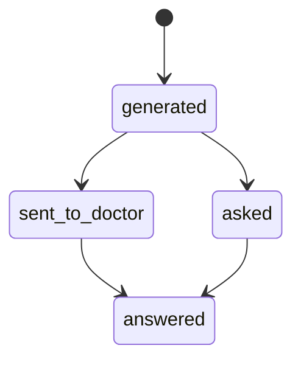
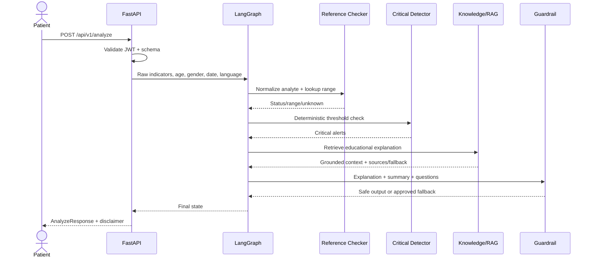
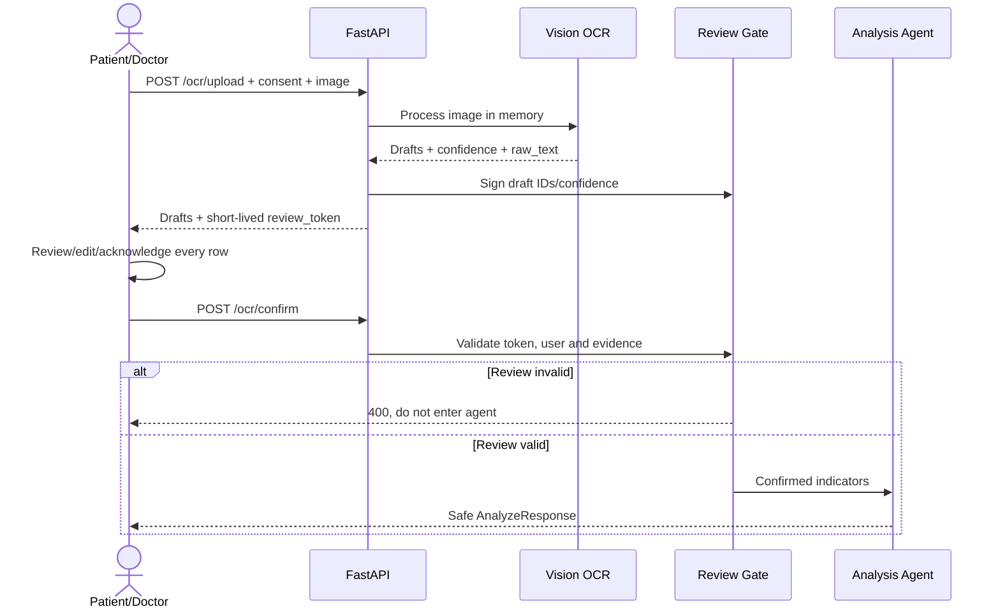

# VMEC-05 — API Document

**Tên đề tài:** AI Agent Giải Thích Kết Quả Xét Nghiệm Bằng Ngôn Ngữ Dễ Hiểu Cho Bệnh Nhân

**API version:** `v1`

**Ngày cập nhật:** 2026-08-12

**Định dạng:** REST/JSON, UTF-8

**Trạng thái tài liệu:** Kết hợp API hiện hành và API đích cho các tính năng nâng cao

## 1. Mục đích và phạm vi

API tiếp nhận phiếu xét nghiệm mô phỏng, đối chiếu khoảng tham chiếu, phát hiện giá trị nguy kịch, tạo giải thích có nguồn và gợi ý câu hỏi trung lập để bệnh nhân trao đổi với bác sĩ.

API **chỉ cung cấp thông tin giáo dục chung**. API không được:

- chẩn đoán hoặc khẳng định bệnh;
- kết luận nguyên nhân của một chỉ số;
- đề nghị thuốc, điều trị hoặc thay đổi điều trị;
- tự trả lời các câu hỏi dành cho bác sĩ do chính agent sinh ra;
- tự tạo khoảng tham chiếu hoặc ý nghĩa y khoa cho chỉ số ngoài thư viện.

Mọi giá trị, ngưỡng và định danh trong các ví dụ dưới đây đều là dữ liệu mô phỏng để minh họa contract; không dùng các ví dụ này để tự diễn giải kết quả xét nghiệm thật.

Ký hiệu trạng thái endpoint trong tài liệu:

| Ký hiệu | Ý nghĩa |
|---|---|
| **Hiện có** | Đã tồn tại trong FastAPI hiện tại |
| **Đề xuất** | Contract đích, cần triển khai thêm |

## 2. Môi trường và URL

| Môi trường | Base URL |
|---|---|
| Local | `http://localhost:8000` |
| Production hiện tại | `https://vmec-05-api-production.up.railway.app` |
| Swagger UI | `{base_url}/docs` |
| OpenAPI JSON | `{base_url}/openapi.json` |

Tất cả endpoint nghiệp vụ dùng prefix `/api/v1`, ngoại trừ `/health` và `/ready`.

## 3. Quy ước chung

### 3.1 HTTP headers

```http
Authorization: Bearer <access_token>
Content-Type: application/json
Accept-Language: vi
X-Request-ID: <optional-client-request-id>
Idempotency-Key: <required-for-selected-write-operations>
```

- JWT hiện tại chứa `sub`, `role`, `exp`.
- Nếu client không gửi `X-Request-ID`, server tự sinh mã và trả lại trong response.
- Response có thể trả `Server-Timing` để đo thời gian xử lý từng công đoạn.
- `Accept-Language` chỉ là gợi ý. Với API phân tích hiện tại, trường `language` trong body là nguồn quyết định.

### 3.2 Vai trò và phạm vi truy cập

| Tài nguyên/hành động | Patient | Doctor | Public |
|---|:---:|:---:|:---:|
| Đăng nhập | ✓ | ✓ | ✓ |
| Xem thông tin tài khoản của mình | ✓ | ✓ |  |
| Phân tích phiếu mô phỏng | ✓ | ✓ |  |
| OCR và xác nhận bản nháp | ✓ | ✓ |  |
| Xem policy/ảnh mẫu OCR | ✓ | ✓ | ✓ |
| Xem report của chính mình | ✓ | ✓ |  |
| Xem danh sách patient/report trong phòng khám |  | ✓ |  |
| Đánh dấu câu hỏi “đã hỏi” | Chủ sở hữu report |  |  |
| Thêm ghi chú chuyên môn |  | ✓ |  |
| Health/readiness | ✓ | ✓ | ✓ |

Quyết định phạm vi: hệ thống áp dụng mô hình **phòng khám đơn**. Mọi tài khoản có role `doctor` được xem hồ sơ bệnh nhân trong hệ thống; không có cơ chế gán doctor–patient ở phiên bản này. Mọi lần đọc/ghi dữ liệu sức khỏe của doctor phải được audit. Khi mở rộng đa cơ sở hoặc có quy trình đặt lịch, cần bổ sung tenant và quan hệ phụ trách.

### 3.3 Thời gian, ID và phân trang

- ID tài nguyên dùng UUID dạng chuỗi.
- Ngày xét nghiệm dùng `YYYY-MM-DD`.
- Timestamp dùng ISO 8601 UTC, ví dụ `2026-08-12T07:15:32Z`.
- Danh sách dùng `limit` và `cursor`; mặc định `limit=20`, tối đa `100`.

Response phân trang đề xuất:

```json
{
  "items": [],
  "page": {
    "next_cursor": null,
    "has_more": false
  }
}
```

## 4. Danh sách endpoint

### 4.1 API hiện có

| Method | Path | Auth | Mô tả |
|---|---|---|---|
| `GET` | `/health` | Không | Liveness check |
| `GET` | `/ready` | Không | Readiness của API và RAG |
| `POST` | `/api/v1/auth/login` | Không | Đăng nhập, nhận JWT |
| `GET` | `/api/v1/auth/me` | Bearer | Lấy tài khoản hiện tại |
| `POST` | `/api/v1/analyze` | Bearer | Phân tích dữ liệu JSON/nhập tay |
| `GET` | `/api/v1/ocr/policy` | Không | Chính sách upload và danh sách ảnh mẫu |
| `GET` | `/api/v1/ocr/samples/{sample_id}` | Không | Lấy ảnh phiếu mẫu |
| `POST` | `/api/v1/ocr/upload` | Bearer | OCR ảnh, trả bản nháp để review |
| `POST` | `/api/v1/ocr/confirm` | Bearer | Xác nhận OCR rồi chạy phân tích |

### 4.2 API đích cho lưu report, memory và HITL

| Method | Path | Role | Mô tả |
|---|---|---|---|
| `POST` | `/api/v1/reports` | Patient/Doctor | Tạo và phân tích report có lưu trữ |
| `GET` | `/api/v1/reports` | Patient/Doctor | Danh sách report được phép xem |
| `GET` | `/api/v1/reports/{report_id}` | Patient/Doctor | Chi tiết report |
| `DELETE` | `/api/v1/reports/{report_id}` | Patient | Yêu cầu xóa report của mình |
| `POST` | `/api/v1/reports/{report_id}/questions/generate` | Patient/Doctor | Sinh lại danh sách câu hỏi an toàn |
| `GET` | `/api/v1/reports/{report_id}/questions` | Patient/Doctor | Lấy câu hỏi theo report |
| `PATCH` | `/api/v1/questions/{question_id}` | Patient | Cập nhật trạng thái checklist |
| `POST` | `/api/v1/questions/{question_id}/notes` | Doctor | Thêm ghi chú cho câu hỏi |
| `POST` | `/api/v1/indicators/{indicator_id}/notes` | Doctor | Thêm ghi chú cho chỉ số |
| `PATCH` | `/api/v1/doctor-notes/{note_id}` | Doctor là tác giả | Sửa ghi chú |
| `GET` | `/api/v1/me/trends/{analyte_id}` | Patient | Xem xu hướng của chính mình |
| `GET` | `/api/v1/doctor/patients` | Doctor | Danh sách bệnh nhân trong phòng khám |
| `GET` | `/api/v1/doctor/patients/{patient_id}/reports` | Doctor | Report của một bệnh nhân |

## 5. Authentication API — hiện có

### 5.1 Đăng nhập

`POST /api/v1/auth/login`

Request:

```json
{
  "username": "benhnhan",
  "password": "benhnhan123"
}
```

Response `200 OK`:

```json
{
  "access_token": "eyJhbGciOi...",
  "token_type": "bearer",
  "role": "patient",
  "username": "benhnhan"
}
```

Lỗi:

- `401`: sai tên đăng nhập hoặc mật khẩu.
- `422`: body không đúng schema.

### 5.2 Lấy phiên đăng nhập

`GET /api/v1/auth/me`

Response `200 OK`:

```json
{
  "username": "benhnhan",
  "role": "patient"
}
```

## 6. Analyze API — hiện có

### 6.1 Phân tích dữ liệu nhập tay/JSON

`POST /api/v1/analyze`

Đây là endpoint **stateless**: kết quả hiện tại không được lưu thành report và chưa có `report_id`. Dữ liệu bắt nguồn từ OCR không được gọi thẳng endpoint này; phải đi qua `/ocr/confirm`.

Request:

```json
{
  "patient_age": 45,
  "patient_gender": "female",
  "test_date": "2026-08-12",
  "language": "vi",
  "indicators": [
    {
      "name": "HbA1c",
      "value": 6.2,
      "unit": "%"
    },
    {
      "name": "LDL",
      "value": 145,
      "unit": "mg/dL"
    }
  ]
}
```

Validation:

| Field | Kiểu | Bắt buộc | Quy tắc |
|---|---|:---:|---|
| `patient_age` | integer | ✓ | `0..120` |
| `patient_gender` | enum | ✓ | `male`, `female`, `other` |
| `test_date` | date | ✓ | `YYYY-MM-DD` |
| `language` | string |  | Mặc định `vi` |
| `indicators` | array | ✓ | Ít nhất 1 phần tử |
| `indicators[].name` | string | ✓ | Không rỗng |
| `indicators[].value` | number | ✓ | Số hữu hạn; từ chối NaN/Infinity |
| `indicators[].unit` | string | ✓ | Không rỗng |

Response `200 OK`:

```json
{
  "indicators": [
    {
      "name": "HbA1c",
      "value": 6.2,
      "unit": "%",
      "reference_low": 4.0,
      "reference_high": 5.6,
      "status": "high",
      "is_abnormal": true,
      "is_critical": false,
      "explanation": "HbA1c phản ánh mức đường huyết trung bình trong một khoảng thời gian. Kết quả này cao hơn khoảng tham chiếu được dùng cho lần phân tích này. Bác sĩ cần xem cùng bệnh sử và các thông tin khác.",
      "sources": [
        "https://medlineplus.gov/lab-tests/hemoglobin-a1c-hba1c-test/"
      ]
    },
    {
      "name": "LDL",
      "value": 145.0,
      "unit": "mg/dL",
      "reference_low": 0.0,
      "reference_high": 129.0,
      "status": "high",
      "is_abnormal": true,
      "is_critical": false,
      "explanation": "LDL là một loại cholesterol trong máu. Giá trị này cao hơn khoảng tham chiếu đang áp dụng; ý nghĩa chính xác phụ thuộc vào bối cảnh sức khỏe của bạn.",
      "sources": [
        "https://medlineplus.gov/ldlthebadcholesterol.html"
      ]
    }
  ],
  "critical_alerts": [],
  "has_critical_values": false,
  "questions_for_doctor": [
    "Chỉ số HbA1c của tôi cao hơn khoảng tham chiếu; bác sĩ có thể giải thích ý nghĩa của kết quả này trong bối cảnh sức khỏe của tôi không?",
    "Chỉ số LDL của tôi cao hơn khoảng tham chiếu; tôi cần theo dõi thêm thông tin gì với bác sĩ?"
  ],
  "summary": "Có 2 chỉ số cao hơn khoảng tham chiếu áp dụng cho phiếu này. Kết quả cần được bác sĩ diễn giải cùng bệnh sử và thông tin lâm sàng.",
  "disclaimer": "Thông tin này chỉ mang tính giáo dục chung, KHÔNG phải chẩn đoán y khoa. Vui lòng trao đổi với bác sĩ để được diễn giải chính xác cho tình trạng của bạn.",
  "guardrail_passed": true,
  "out_of_scope_indicators": [],
  "error": "",
  "is_placeholder": false
}
```

Giá trị `status` hiện có:

| Giá trị | Ý nghĩa |
|---|---|
| `normal` | Trong khoảng tham chiếu |
| `low` | Thấp hơn khoảng tham chiếu |
| `high` | Cao hơn khoảng tham chiếu |
| `critical_low` | Thấp tới ngưỡng cảnh báo khẩn |
| `critical_high` | Cao tới ngưỡng cảnh báo khẩn |
| `unknown` | Không đủ dữ liệu chuẩn để phân loại |

`guardrail_passed=false` nghĩa là nội dung ban đầu từng vi phạm guardrail và đã được rewrite/fallback trước khi trả về. Client không được hiểu trường này là “response hiện tại vẫn chứa nội dung nguy hiểm”.

### 6.2 Response có giá trị nguy kịch

```json
{
  "indicators": [
    {
      "name": "Potassium",
      "value": 6.5,
      "unit": "mmol/L",
      "reference_low": 3.5,
      "reference_high": 5.1,
      "status": "critical_high",
      "is_abnormal": true,
      "is_critical": true,
      "explanation": "Giá trị kali này nằm ở mức cảnh báo khẩn theo ngưỡng an toàn đang áp dụng.",
      "sources": []
    }
  ],
  "critical_alerts": [
    {
      "indicator_name": "Potassium",
      "value": 6.5,
      "unit": "mmol/L",
      "message": "Cần liên hệ cơ sở y tế ngay; không chờ đến lịch khám dự kiến."
    }
  ],
  "has_critical_values": true,
  "questions_for_doctor": [
    "Chỉ số kali của tôi đang ở mức cảnh báo khẩn; nhân viên y tế cần tôi cung cấp thêm thông tin gì ngay lúc này?"
  ],
  "summary": "Phiếu có giá trị ở mức cảnh báo khẩn.",
  "disclaimer": "Thông tin này không phải chẩn đoán. Hãy liên hệ cơ sở y tế ngay theo cảnh báo.",
  "guardrail_passed": true,
  "out_of_scope_indicators": [],
  "error": "",
  "is_placeholder": false
}
```

Quy tắc client bắt buộc:

1. Nếu `has_critical_values=true`, hiển thị cảnh báo khẩn trước summary và câu hỏi.
2. Không chỉ dựa vào màu; phải có text/icon và hỗ trợ screen reader.
3. Không được hạ cấp hoặc ẩn `critical_alerts` sau disclaimer.
4. Cảnh báo khẩn là chỉ dẫn liên hệ y tế, không phải chẩn đoán.

### 6.3 Chỉ số ngoài phạm vi

Khi không tra được chỉ số/đơn vị trong thư viện:

- `status="unknown"`;
- `reference_low` và `reference_high` là `null`;
- tên chỉ số có trong `out_of_scope_indicators`;
- hệ thống không bịa khoảng tham chiếu hoặc giải thích;
- câu hỏi fallback hướng bệnh nhân trao đổi với bác sĩ.

## 7. OCR API — hiện có

### 7.1 Lấy policy upload

`GET /api/v1/ocr/policy`

Response:

```json
{
  "mode": "demo_only",
  "upload_enabled": true,
  "consent_required": true,
  "custom_image_allowed": false,
  "consent_text": "Tôi xác nhận đây là dữ liệu mô phỏng, không phải phiếu xét nghiệm thật của tôi hay của người khác.",
  "samples": [
    {
      "sample_id": "normal",
      "label": "Phiếu bình thường",
      "description": "Ảnh mẫu phục vụ demo OCR",
      "size_bytes": 123456
    }
  ]
}
```

`mode`:

- `internal_only`: upload bị tắt;
- `demo_only`: chỉ chấp nhận đúng ảnh mẫu do hệ thống cung cấp;
- `open_with_consent`: cho phép ảnh tùy chọn khi đã xác nhận consent.

### 7.2 Lấy ảnh mẫu

`GET /api/v1/ocr/samples/{sample_id}`

- Response thành công: binary `image/png`.
- `404`: không tồn tại ảnh mẫu.

### 7.3 Upload ảnh và nhận bản nháp OCR

`POST /api/v1/ocr/upload`

Content type: `multipart/form-data`.

| Field | Kiểu | Bắt buộc | Mô tả |
|---|---|:---:|---|
| `file` | binary | ✓ | Ảnh phiếu xét nghiệm mô phỏng |
| `consent_acknowledged` | boolean | ✓ | Phải là `true` |

Ví dụ cURL:

```bash
curl -X POST "http://localhost:8000/api/v1/ocr/upload" \
  -H "Authorization: Bearer $TOKEN" \
  -F "consent_acknowledged=true" \
  -F "file=@report.png;type=image/png"
```

Response `200 OK`:

```json
{
  "source_image": "report.png",
  "model_used": "vision-model",
  "review_token": "signed-short-lived-token",
  "low_confidence_threshold": 0.7,
  "expires_in_seconds": 900,
  "metadata_hint": {},
  "indicators": [
    {
      "draft_id": "9f912adf89ab4cf7b451aaf7e8f6c1b2",
      "name": "Glucose",
      "value": 5.2,
      "unit": "mmol/L",
      "confidence": 0.62,
      "raw_text": "Glucose 5.2 mmol/L",
      "needs_review": true
    }
  ]
}
```

Ảnh hiện tại chỉ tồn tại trong RAM trong vòng đời request, không ghi xuống filesystem/database và không log nội dung ảnh. `review_token` gắn với user, có thời hạn và không chứa giá trị xét nghiệm.

Lỗi đặc thù:

| HTTP | Trường hợp |
|---:|---|
| `400` | Chưa xác nhận consent hoặc ảnh không hợp lệ |
| `401` | Thiếu/sai JWT |
| `403` | `demo_only` nhưng upload ảnh không thuộc bộ mẫu |
| `422` | Không tìm thấy chỉ số xét nghiệm trong ảnh |
| `502` | Dịch vụ OCR/Vision lỗi |
| `503` | OCR tắt hoặc chưa cấu hình provider |

### 7.4 Xác nhận OCR và phân tích

`POST /api/v1/ocr/confirm`

Request:

```json
{
  "review_token": "signed-short-lived-token",
  "patient_age": 45,
  "patient_gender": "female",
  "test_date": "2026-08-12",
  "language": "vi",
  "indicators": [
    {
      "draft_id": "9f912adf89ab4cf7b451aaf7e8f6c1b2",
      "name": "Glucose",
      "value": 5.2,
      "unit": "mmol/L",
      "included": true,
      "reviewed": true,
      "low_confidence_acknowledged": true
    }
  ]
}
```

Server từ chối request nếu:

- token sai, hết hạn hoặc thuộc user khác;
- thiếu dòng OCR so với token;
- còn dòng chưa `reviewed=true`;
- giữ lại dòng confidence thấp nhưng chưa `low_confidence_acknowledged=true`;
- loại bỏ toàn bộ các dòng.

Response thành công dùng cùng schema với `POST /api/v1/analyze`.

## 8. Reports API — đề xuất

Nhóm API này bổ sung persistence để hỗ trợ history, trend, HITL và ownership. Không thay đổi contract của `/analyze` hiện hành.

### 8.1 Tạo và phân tích report

`POST /api/v1/reports`

Header:

```http
Idempotency-Key: 018f4d65-9192-7ec5-a7f4-6f488df23f01
```

Request dùng schema tương tự `AnalyzeRequest`. Doctor có thể tạo report cho bệnh nhân bằng `patient_id`; patient không được gửi trường này.

```json
{
  "patient_id": "01J4PATIENT00000000000001",
  "patient_age": 45,
  "patient_gender": "female",
  "test_date": "2026-08-12",
  "language": "vi",
  "input_source": "manual",
  "indicators": [
    {"name": "HbA1c", "value": 6.2, "unit": "%"}
  ]
}
```

Response `201 Created`:

```json
{
  "report_id": "01J4REPORT0000000000000001",
  "status": "completed",
  "created_at": "2026-08-12T07:15:32Z",
  "analysis": {
    "has_critical_values": false,
    "summary": "Có 1 chỉ số cao hơn khoảng tham chiếu áp dụng cho phiếu này.",
    "disclaimer": "Thông tin giáo dục chung, không phải chẩn đoán y khoa.",
    "guardrail": {
      "initial_output_passed": true,
      "final_output_safe": true,
      "action": "none"
    }
  },
  "indicators": [
    {
      "indicator_id": "01J4INDICATOR0000000000001",
      "analyte_id": "hba1c",
      "display_name": "HbA1c",
      "value": 6.2,
      "unit": "%",
      "reference_range": {"low": 4.0, "high": 5.6, "unit": "%"},
      "severity": "abnormal",
      "direction": "high",
      "explanation": "...",
      "sources": [
        {
          "title": "Hemoglobin A1C test",
          "url": "https://medlineplus.gov/lab-tests/hemoglobin-a1c-hba1c-test/",
          "publisher": "MedlinePlus",
          "accessed_at": "2026-08-12T07:15:30Z"
        }
      ]
    }
  ],
  "questions": [
    {
      "question_id": "01J4QUESTION0000000000001",
      "indicator_id": "01J4INDICATOR0000000000001",
      "priority": "abnormal",
      "text": "Chỉ số HbA1c của tôi cao hơn khoảng tham chiếu; bác sĩ có thể giải thích ý nghĩa của kết quả này trong bối cảnh sức khỏe của tôi không?",
      "status": "generated",
      "urgent_message": null
    }
  ],
  "out_of_scope_indicators": []
}
```

`severity` là nguồn sự thật duy nhất ở API đích:

- `normal`;
- `abnormal`;
- `critical`;
- `unknown`.

`direction` biểu diễn hướng: `low`, `high`, `none`, `unknown`. Không lưu riêng `is_abnormal` và `is_critical` trong model đích; client suy ra từ `severity` để tránh dữ liệu mâu thuẫn.

### 8.2 Lấy danh sách report

`GET /api/v1/reports?limit=20&cursor=<cursor>&from=2026-01-01&to=2026-08-12`

- Patient: chỉ trả report của chính mình.
- Doctor: trả report trong hệ thống theo mô hình phòng khám đơn; có thể lọc `patient_id`.
- Response danh sách chỉ chứa metadata và summary ngắn, không trả toàn bộ explanations để giảm PHI trong response.

### 8.3 Lấy chi tiết report

`GET /api/v1/reports/{report_id}`

Response dùng schema chi tiết ở mục 8.1, kèm doctor notes nếu caller có quyền.

### 8.4 Xóa report

`DELETE /api/v1/reports/{report_id}`

- Chỉ chủ sở hữu patient hoặc quy trình quản trị dữ liệu được phép.
- Trả `202 Accepted` nếu xóa bất đồng bộ.
- Xóa report phải cascade questions/notes theo chính sách retention và tạo audit event không chứa nội dung PHI.

## 9. Questions for Doctor API — đề xuất

### 9.1 Quy tắc sinh câu hỏi

1. Chỉ tạo câu hỏi từ dữ liệu đã qua reference checker, critical detector và guardrail.
2. Mỗi chỉ số `abnormal` hoặc `critical` tạo tối đa một câu hỏi chính, gắn bằng `indicator_id`.
3. Thứ tự: `critical` → bất thường lặp lại theo trend → bất thường đơn lẻ → borderline.
4. Câu hỏi phải trung lập, mở, không chứa kết luận bệnh/nguyên nhân/điều trị.
5. Câu hỏi nguy kịch đứng đầu và có `urgent_message`; UI không được biến nó thành câu hỏi chờ lịch khám.
6. Không ép sinh câu hỏi giả chỉ để đủ số lượng. API trả đúng số candidate hợp lệ; mặc định UI hiển thị tối đa 7 câu ưu tiên nhất.
7. Trend question là nội dung tham khảo rule-based ở màn hình xu hướng; không tự động gửi bác sĩ và không lưu vào `report_questions`.
8. Agent không tự sinh câu trả lời cho câu hỏi. Chỉ doctor note mới là phản hồi của con người có thẩm quyền.

Quy tắc số 6 là quyết định làm rõ mâu thuẫn giữa yêu cầu “3–7 câu” và quyết định dữ liệu mới nhất “một câu cho mỗi chỉ số”. An toàn và tính truy vết được ưu tiên hơn việc chèn câu hỏi để đủ số lượng.

### 9.2 Sinh/sinh lại câu hỏi

`POST /api/v1/reports/{report_id}/questions/generate`

```json
{
  "language": "vi",
  "max_displayed": 7
}
```

Response:

```json
{
  "items": [
    {
      "question_id": "01J4QUESTION0000000000001",
      "indicator_id": "01J4INDICATOR0000000000001",
      "priority": "critical",
      "text": "Chỉ số kali của tôi đang ở mức cảnh báo khẩn; nhân viên y tế cần tôi cung cấp thêm thông tin gì ngay lúc này?",
      "status": "generated",
      "urgent_message": "Cần liên hệ cơ sở y tế ngay; không chờ đến lịch khám."
    }
  ],
  "total_candidates": 1,
  "displayed": 1,
  "truncated": false,
  "disclaimer": "Đây là gợi ý câu hỏi tham khảo, không phải kết luận y khoa — vui lòng trao đổi trực tiếp với bác sĩ.",
  "guardrail": {
    "final_output_safe": true,
    "action": "none"
  }
}
```

Endpoint phải idempotent theo `report_id + analysis_version + language`. Không tạo bản ghi trùng nếu input không đổi.

### 9.3 Cập nhật checklist câu hỏi

`PATCH /api/v1/questions/{question_id}`

Request:

```json
{
  "status": "asked"
}
```

Các trạng thái hợp lệ:



- Patient được chuyển `generated → asked`.
- Việc gửi cho doctor chuyển `generated → sent_to_doctor`.
- Khi doctor thêm note, server chuyển trạng thái sang `answered` trong cùng transaction.

## 10. Doctor HITL API — đề xuất

### 10.1 Thêm ghi chú cho câu hỏi

`POST /api/v1/questions/{question_id}/notes`

Role: `doctor`.

Request:

```json
{
  "note_text": "Đã trao đổi trực tiếp với bệnh nhân trong buổi khám. Cần diễn giải cùng bệnh sử và các xét nghiệm liên quan."
}
```

Response `201 Created`:

```json
{
  "note_id": "01J4NOTE000000000000000001",
  "target_type": "report_question",
  "target_id": "01J4QUESTION0000000000001",
  "note_text": "Đã trao đổi trực tiếp với bệnh nhân trong buổi khám. Cần diễn giải cùng bệnh sử và các xét nghiệm liên quan.",
  "author": {
    "user_id": "01J4DOCTOR000000000000001",
    "display_name": "Bác sĩ Demo"
  },
  "created_at": "2026-08-12T08:00:00Z",
  "updated_at": "2026-08-12T08:00:00Z"
}
```

### 10.2 Thêm ghi chú cho chỉ số

`POST /api/v1/indicators/{indicator_id}/notes`

Contract giống mục 10.1, với `target_type="indicator"`.

### 10.3 Sửa ghi chú

`PATCH /api/v1/doctor-notes/{note_id}`

- Chỉ doctor là tác giả được sửa.
- Không hard-delete lịch sử; lưu revision/audit trước và sau khi sửa.
- Nội dung note là nội dung do doctor nhập, phải được hiển thị tách biệt với nội dung AI.

## 11. Trend/Memory API — đề xuất

`GET /api/v1/me/trends/{analyte_id}?from=2026-01-01&to=2026-08-12`

Response:

```json
{
  "analyte": {
    "analyte_id": "hba1c",
    "display_name": "HbA1c",
    "canonical_unit": "%"
  },
  "points": [
    {"test_date": "2026-02-10", "value": 5.7, "unit": "%", "report_id": "..."},
    {"test_date": "2026-05-12", "value": 5.9, "unit": "%", "report_id": "..."},
    {"test_date": "2026-08-12", "value": 6.2, "unit": "%", "report_id": "..."}
  ],
  "trend": {
    "direction": "increasing",
    "consecutive_points": 3,
    "method": "rule_based",
    "question_template": "Chỉ số HbA1c của tôi tăng qua 3 lần xét nghiệm gần đây; bác sĩ có thể giúp tôi hiểu xu hướng này và cần theo dõi gì thêm không?"
  },
  "disclaimer": "Xu hướng chỉ mô tả thay đổi số học, không xác định chẩn đoán hoặc nguyên nhân."
}
```

Quy tắc:

- Match lịch sử bằng `analyte_id` chuẩn hóa, không bằng tên OCR tự do.
- Chỉ so sánh sau khi chuẩn hóa đơn vị an toàn.
- Nếu không có phép đổi đơn vị được duyệt, bỏ điểm khỏi chuỗi và trả warning.
- Trend là phép tính rule-based, không để LLM quyết định tăng/giảm.
- Tôn trọng `max_gap_days_for_trend` trong catalog.

## 12. Error contract

### 12.1 Contract hiện tại

FastAPI hiện tại trả lỗi dạng:

```json
{
  "detail": "Chưa đăng nhập"
}
```

Validation error `422` dùng schema mặc định của FastAPI.

### 12.2 Contract đích

Các endpoint mới nên dùng error envelope ổn định:

```json
{
  "error": {
    "code": "OCR_REVIEW_REQUIRED",
    "message": "Cần xác nhận tất cả dòng OCR trước khi phân tích.",
    "details": {
      "draft_ids": ["9f912adf89ab4cf7b451aaf7e8f6c1b2"]
    },
    "request_id": "4ec1f19b6f0f4f7a8ff1c098e81f7894"
  }
}
```

| HTTP | Code đề xuất | Ý nghĩa |
|---:|---|---|
| `400` | `INVALID_REQUEST` | Request sai quy tắc nghiệp vụ |
| `400` | `OCR_REVIEW_REQUIRED` | Chưa hoàn tất review |
| `400` | `OCR_REVIEW_TOKEN_INVALID` | Token sai/hết hạn/không đúng user |
| `401` | `AUTH_REQUIRED` | Chưa đăng nhập |
| `401` | `TOKEN_INVALID` | JWT sai hoặc hết hạn |
| `403` | `FORBIDDEN` | Đúng danh tính nhưng sai quyền |
| `404` | `RESOURCE_NOT_FOUND` | Không tồn tại hoặc không được phép biết tài nguyên tồn tại |
| `409` | `STATE_CONFLICT` | Chuyển trạng thái không hợp lệ |
| `413` | `FILE_TOO_LARGE` | File vượt giới hạn |
| `415` | `UNSUPPORTED_MEDIA_TYPE` | Định dạng file không hỗ trợ |
| `422` | `VALIDATION_ERROR` | Sai schema |
| `422` | `NO_LAB_INDICATORS_FOUND` | OCR không tìm thấy chỉ số |
| `429` | `RATE_LIMITED` | Vượt giới hạn request |
| `502` | `UPSTREAM_OCR_ERROR` | Provider OCR lỗi |
| `503` | `SERVICE_UNAVAILABLE` | Thành phần bắt buộc chưa sẵn sàng |

Không trả stack trace, prompt, API key, raw provider error hoặc nội dung nội bộ của LangGraph ra client.

## 13. Luồng nghiệp vụ

### 13.1 Nhập tay



### 13.2 OCR có Human Review Gate



### 13.3 Câu hỏi và doctor HITL

```mermaid
sequenceDiagram
    actor P as Patient
    participant API as API
    participant Q as Question Generator
    participant GR as Guardrail
    actor D as Doctor

    API->>Q: Abnormal/critical indicators + trend metadata
    Q->>GR: Neutral question candidates
    GR-->>API: Safe questions/fallback
    API-->>P: Prioritized checklist + urgent alert
    P->>API: Mark asked / send to doctor
    D->>API: Add human note
    API->>API: Save author + timestamp + audit; mark answered
    API-->>P: Doctor note shown separately from AI content
```

## 14. Guardrail và an toàn y khoa

Guardrail áp dụng cho `summary`, `explanation`, `questions`, và mọi nội dung fallback do LLM tạo.

Pipeline bắt buộc:

1. Validator cục bộ kiểm tra nội dung chẩn đoán, nguyên nhân, thuốc và điều trị.
2. Nếu vi phạm, cho phép LLM rewrite đúng một lần.
3. Validate lại bằng cùng validator.
4. Nếu vẫn vi phạm hoặc rewrite lỗi, dùng template đã duyệt.
5. Log kết quả `pass/rewrite/fallback/block` nhưng không log PHI thô.

Các rule-based safety component — reference range, unit normalization và critical threshold — không được để LLM quyết định hoặc ghi đè.

Disclaimer không thay thế guardrail. Một response chứa nội dung chẩn đoán vẫn là lỗi kể cả khi có disclaimer.

## 15. Bảo mật PHI và audit

- Chỉ chấp nhận dữ liệu mô phỏng trong bản demo công khai hiện tại.
- Mã hóa TLS khi truyền và mã hóa dữ liệu lưu trữ khi triển khai persistence.
- Patient chỉ đọc report của chính mình; doctor đọc dữ liệu theo mô hình phòng khám đơn.
- Mọi truy cập của doctor vào report, mọi doctor note và thay đổi trạng thái phải có audit event.
- Không log ảnh, raw OCR text đầy đủ, giá trị xét nghiệm hoặc nội dung note trong application log thông thường.
- Không đưa PHI vào URL/query string; dùng path ID không đoán được và body.
- Access token không được lưu trong log. Production nên chuyển token khỏi `localStorage` sang cookie `HttpOnly`, `Secure`, `SameSite` hoặc cơ chế tương đương sau khi có CSRF design.
- Có rate limit riêng cho login, OCR và analyze.
- Với resource không có quyền xem, ưu tiên trả `404` để tránh dò ID.

Audit event tối thiểu:

```json
{
  "event_id": "01J4AUDIT0000000000000001",
  "event_type": "DOCTOR_NOTE_CREATED",
  "actor_id": "01J4DOCTOR000000000000001",
  "actor_role": "doctor",
  "resource_type": "report_question",
  "resource_id": "01J4QUESTION0000000000001",
  "occurred_at": "2026-08-12T08:00:00Z",
  "request_id": "4ec1f19b6f0f4f7a8ff1c098e81f7894"
}
```

## 16. Yêu cầu phi chức năng

| Hạng mục | Mục tiêu |
|---|---|
| Phân tích JSON | p95 ≤ 5 giây trong tải demo bình thường |
| OCR upload | Theo dõi riêng latency provider; không gộp SLO với analyze |
| Availability core API | RAG lỗi được fallback, không làm chết reference/critical pipeline |
| Idempotency | Tạo report, generate questions và doctor note chống ghi trùng khi retry |
| Observability | `X-Request-ID`, `Server-Timing`, structured audit |
| Input limits | Giới hạn số indicators/report, độ dài text và kích thước ảnh |
| Accessibility | Cảnh báo nguy kịch không phụ thuộc duy nhất vào màu |
| Localization | `vi`, `en`; giữ nguyên tên analyte chuẩn như HbA1c |

## 17. Khoảng cách giữa API hiện tại và API đích

| Hạng mục | Hiện tại | Cần bổ sung |
|---|---|---|
| Auth | Login + JWT + `/me` | Refresh/logout, revoke, cookie production |
| Analyze | Stateless `/analyze` | `reports`, ownership và history |
| Questions | `list[str]` trong response | `report_questions` có ID, indicator, priority, status |
| Doctor HITL | Chưa có endpoint/DB | `doctor_notes` + audit + author/timestamp |
| Trend | Chưa có persistence | `indicator_catalog`, canonical unit và trend query |
| OCR | Draft/review gate đã có | Persistence provenance đã de-identify nếu chuyển sang clinical use |
| Out of scope | List trong response | `out_of_scope_log` phục vụ vận hành |
| Severity | `status` + hai boolean | `severity` + `direction` làm nguồn sự thật duy nhất |
| Error | FastAPI `{detail}` | Error envelope có code/request ID |
| Doctor access | Chưa có patient/report resource | Clinic-wide RBAC + audit, không assignment |

## 18. Checklist nghiệm thu API

- Mọi endpoint nghiệp vụ riêng tư từ chối request thiếu/sai JWT.
- Patient không đọc/sửa report của patient khác.
- Doctor đọc được report theo quyết định phòng khám đơn và mọi lượt đọc được audit.
- `critical` luôn bao hàm trạng thái bất thường ở contract đích và đứng đầu response/câu hỏi.
- Chỉ số unknown không có reference range bịa đặt.
- OCR không vào agent trước khi tất cả dòng được review hợp lệ.
- Câu hỏi gắn đúng `indicator_id`, trung lập và qua guardrail.
- Agent không tự trả lời câu hỏi dành cho doctor.
- Doctor note có tác giả, timestamp, revision và hiển thị tách biệt với AI.
- Trend dựa trên `analyte_id` + đơn vị chuẩn hóa, không match theo tên OCR tự do.
- Response luôn có disclaimer; disclaimer không được dùng để hợp thức hóa nội dung vi phạm.
- Không rò stack trace, secret, prompt hoặc raw upstream error.
- OpenAPI/Swagger được cập nhật cùng code và có contract test cho các ví dụ chính.
