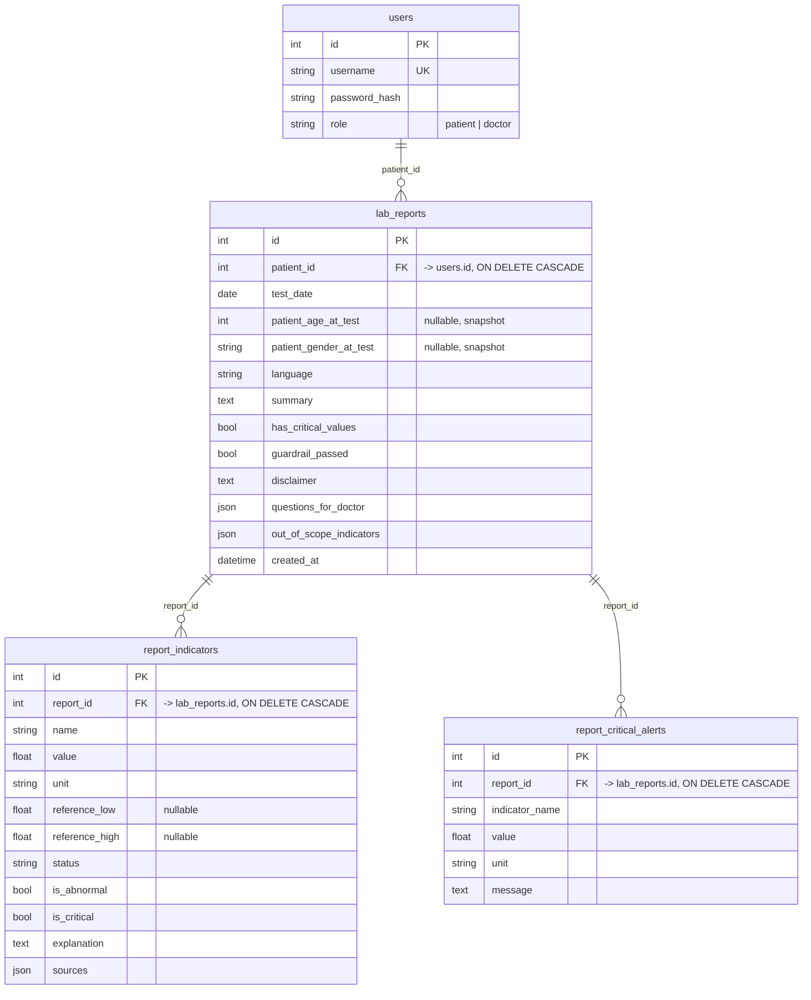

# Database Design — User + Bệnh nhân + Lịch sử xét nghiệm

**Owner:** Vũ (Tech Lead) — TechDebt V3
**Trạng thái:** Schema đã implement trên `feature/patient-history-db`
(3 bảng SQLAlchemy trong `db.py` + 3 Pydantic schema trong `schemas.py`).
**Chưa có API/endpoint nào dùng schema này** — tầng persistence (đăng ký
patient, tự động lưu report sau `/analyze`, endpoint xem lịch sử) thuộc
phạm vi riêng của Duy (Nhiệm vụ 1 & 3, TechDebt V3), cố tình không làm ở
đây để không lấn phân công.
**Nguồn implement thật:** [`src/models/db.py`](../../src/models/db.py) —
tài liệu này mô tả lại đúng những gì đã code, không phải bản thiết kế
trên giấy. Nếu code đổi mà quên cập nhật file này, coi code là đúng.

## Bài toán

Giải quyết luồng: Đăng ký → đăng nhập → xác định role → lưu xét nghiệm →
truy vấn lại lịch sử bệnh nhân. Guest không cần persistent user.

## ER Diagram



## Mô tả 4 bảng

### `users` (auth gốc, không đổi)
| Field | Kiểu | Ràng buộc | Ý nghĩa |
|---|---|---|---|
| `id` | Integer | PK, autoincrement | |
| `username` | String | unique, not null, index | |
| `password_hash` | String | not null | bcrypt hash — **không bao giờ** lưu plaintext |
| `role` | String | not null | `"patient"` \| `"doctor"` |

### `lab_reports` — 1 phiếu xét nghiệm đã phân tích
| Field | Kiểu | Ràng buộc | Ý nghĩa |
|---|---|---|---|
| `id` | Integer | PK | |
| `patient_id` | Integer | FK → `users.id`, not null, `ON DELETE CASCADE`, index | Đây là cách 1 phiếu liên kết với patient |
| `test_date` | Date | not null, index | Ngày xét nghiệm thật, khác `created_at` |
| `patient_age_at_test` | Integer | nullable | Snapshot tuổi lúc xét nghiệm |
| `patient_gender_at_test` | String | nullable | Snapshot giới tính lúc xét nghiệm |
| `language` | String | not null, default `"vi"` | |
| `summary` | Text | not null, default `""` | |
| `has_critical_values` | Boolean | not null, default `False` | |
| `guardrail_passed` | Boolean | not null, default `True` | |
| `disclaimer` | Text | not null, default `""` | |
| `questions_for_doctor` | JSON (`list[str]`) | not null, default `[]` | |
| `out_of_scope_indicators` | JSON (`list[str]`) | not null, default `[]` | |
| `created_at` | DateTime | not null, default `now(UTC)` | |

`patient_age_at_test`/`patient_gender_at_test` là snapshot cố ý, không
join sang `users` — `users` không lưu tuổi cố định, và tuổi/giới tính
khai báo có thể khác nhau giữa các lần xét nghiệm của cùng 1 patient.

### `report_indicators` — từng chỉ số trong 1 phiếu
| Field | Kiểu | Ràng buộc | Ý nghĩa |
|---|---|---|---|
| `id` | Integer | PK | |
| `report_id` | Integer | FK → `lab_reports.id`, not null, `ON DELETE CASCADE`, index | |
| `name`, `value`, `unit` | String/Float/String | not null | |
| `reference_low`, `reference_high` | Float | nullable | |
| `status` | String | not null, default `"unknown"` | |
| `is_abnormal`, `is_critical` | Boolean | not null, default `False` | |
| `explanation` | Text | not null, default `""` | |
| `sources` | JSON (`list[str]`) | not null, default `[]` | |

### `report_critical_alerts` — cảnh báo khẩn của 1 phiếu (0..N, thường rất ít)
| Field | Kiểu | Ràng buộc | Ý nghĩa |
|---|---|---|---|
| `id` | Integer | PK | |
| `report_id` | Integer | FK → `lab_reports.id`, not null, `ON DELETE CASCADE`, index | |
| `indicator_name`, `value`, `unit`, `message` | String/Float/String/Text | not null | |

## Quan hệ

```
users (1) ─── (N) lab_reports (1) ─── (N) report_indicators
                              (1) ─── (N) report_critical_alerts
```

Xoá 1 `user` → cascade xoá toàn bộ `lab_reports` + con của nó. Xoá 1
`lab_report` → cascade xoá `report_indicators`/`report_critical_alerts`
của riêng phiếu đó. Trên SQLite, cascade chỉ có hiệu lực vì `db.py` bật
`PRAGMA foreign_keys=ON` cho từng connection lúc khởi tạo engine — SQLite
mặc định bỏ qua `ON DELETE CASCADE` nếu không bật pragma này.

## Trả lời 5 câu hỏi checklist

1. **User đăng ký xong được lưu ở đâu?** → bảng `users`. (`RegisterRequest`
   schema đã định nghĩa sẵn trong `schemas.py`; endpoint `POST /auth/register`
   thật thuộc phạm vi Duy — Nhiệm vụ 1.)
2. **Password lưu dưới dạng gì?** → bcrypt hash (`hash_password()` trong
   `src/services/auth.py`, hàm có sẵn từ trước), không bao giờ plaintext.
3. **Làm cách nào phân biệt doctor và patient?** → cột `users.role`,
   chỉ nhận `"patient"` hoặc `"doctor"`. Theo policy nhóm chốt: đăng ký
   qua endpoint public luôn ép `role="patient"` — tài khoản doctor được
   cấp sẵn (seed), không tự đăng ký.
4. **Một phiếu xét nghiệm liên kết với patient bằng cách nào?** →
   `lab_reports.patient_id` là FK trỏ thẳng `users.id`.
5. **Cho `patient_id=X`, từ ngày A đến B, truy vấn lịch sử bằng dữ liệu nào?**
   ```sql
   SELECT * FROM lab_reports
   WHERE patient_id = :X AND test_date BETWEEN :A AND :B
   ORDER BY test_date;
   ```
   Xem chi tiết từng chỉ số/cảnh báo của 1 report thì join thêm
   `report_indicators`/`report_critical_alerts` theo `report_id`.
   `LabReportSummarySchema`/`LabReportDetailSchema` đã định nghĩa sẵn cho
   2 dạng response này; endpoint thật (`GET /patients/me/history` cho
   patient, `GET /patients/{patient_id}/history` cho doctor) thuộc phạm
   vi Duy — Nhiệm vụ 3.

## Guest

Guest = request không có JWT hợp lệ. Guest **không có row ở bất kỳ bảng
nào** — mọi bảng lịch sử (`lab_reports`, `report_indicators`,
`report_critical_alerts`) đều bắt buộc `patient_id`/`report_id` NOT NULL
trỏ vào một hàng thật đã tồn tại. Vì vậy guest tự động không lưu được gì
mà không cần bảng hay logic loại trừ riêng — kiến trúc DB tự nhiên đã
loại guest ra khỏi persistence.

(Việc cho phép guest gọi `/analyze` ẩn danh ở tầng API là một quyết định
khác, thuộc phạm vi "Guest flow" trong TechDebt V3 — không đổi ở đây.)
