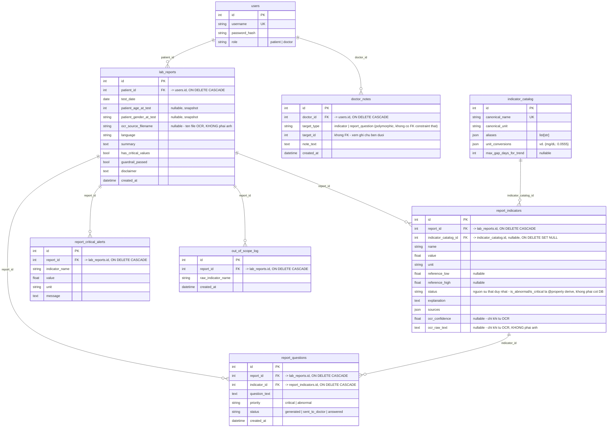

# Database Design — User + Bệnh nhân + Lịch sử xét nghiệm

**Owner:** Vũ (Tech Lead) — TechDebt V3
**Trạng thái:** Schema đã implement trên `feature/patient-history-db`
(8 bảng SQLAlchemy trong `db.py` + schema Pydantic tương ứng trong
`schemas.py`).
**Chưa có API/endpoint nào dùng schema này** — tầng persistence (đăng ký
patient, tự động lưu report sau `/analyze`, endpoint xem lịch sử, sinh
câu hỏi cho bác sĩ, ghi chú của bác sĩ) thuộc phạm vi riêng của Duy
(Nhiệm vụ 1 & 3, TechDebt V3) và của node `generate_questions` (chưa ai
làm — xem `docs/version-kickoff/version-3-kickoff.md`), cố tình không
làm ở đây để không lấn phân công.
**Nguồn implement thật:** [`src/models/db.py`](../../src/models/db.py) —
tài liệu này mô tả lại đúng những gì đã code, không phải bản thiết kế
trên giấy. Nếu code đổi mà quên cập nhật file này, coi code là đúng.

## Bài toán

Giải quyết luồng: Đăng ký → đăng nhập → xác định role → lưu xét nghiệm →
truy vấn lại lịch sử bệnh nhân. Guest không cần persistent user. Mở rộng
sau review: lưu ghi chú bác sĩ (HITL), chuẩn hoá tên chỉ số cho trend,
và log riêng các chỉ số ngoài phạm vi hỗ trợ.

## ER Diagram



## Mô tả từng bảng

### `users` (auth gốc, không đổi)
| Field | Kiểu | Ràng buộc | Ý nghĩa |
|---|---|---|---|
| `id` | Integer | PK, autoincrement | |
| `username` | String | unique, not null, index | |
| `password_hash` | String | not null | bcrypt hash — **không bao giờ** lưu plaintext |
| `role` | String | not null | `"patient"` \| `"doctor"` |

### `lab_reports` — 1 phiếu xét nghiệm đã phân tích
| Field | Kiểu | Ràng buộc | Ý nghĩa |
|---|---|---|---|
| `id` | Integer | PK | |
| `patient_id` | Integer | FK → `users.id`, not null, `ON DELETE CASCADE`, index | Đây là cách 1 phiếu liên kết với patient |
| `test_date` | Date | not null, index | Ngày xét nghiệm thật, khác `created_at` |
| `patient_age_at_test` | Integer | nullable | Snapshot tuổi lúc xét nghiệm |
| `patient_gender_at_test` | String | nullable | Snapshot giới tính lúc xét nghiệm |
| `ocr_source_filename` | String | nullable | Tên file OCR (nếu report tới từ luồng OCR) — **không phải** đường dẫn/nội dung ảnh, xem cảnh báo privacy bên dưới |
| `language` | String | not null, default `"vi"` | |
| `summary` | Text | not null, default `""` | |
| `has_critical_values` | Boolean | not null, default `False` | |
| `guardrail_passed` | Boolean | not null, default `True` | |
| `disclaimer` | Text | not null, default `""` | |
| `created_at` | DateTime | not null, default `now(UTC)` | |

`patient_age_at_test`/`patient_gender_at_test` là snapshot cố ý, không
join sang `users` — `users` không lưu tuổi cố định, và tuổi/giới tính
khai báo có thể khác nhau giữa các lần xét nghiệm của cùng 1 patient.

`questions_for_doctor`/`out_of_scope_indicators` (JSON list cũ) đã bị
**bỏ khỏi bảng này**, thay bằng 2 bảng con `report_questions` và
`out_of_scope_log` — tránh 2 nguồn sự thật cho cùng 1 dữ liệu (JSON blob
song song với bảng chuẩn hoá).

`ocr_source_filename` **chỉ lưu tên file** (label hiển thị, đúng field
`source_image` đã có sẵn trong `OCRReviewResponse` — đã trả về client
rồi nên không phát sinh rủi ro mới), **không phải đường dẫn hay nội dung
ảnh** — xem cảnh báo privacy ở mục `report_indicators` bên dưới.

### `report_indicators` — từng chỉ số trong 1 phiếu
| Field | Kiểu | Ràng buộc | Ý nghĩa |
|---|---|---|---|
| `id` | Integer | PK | |
| `report_id` | Integer | FK → `lab_reports.id`, not null, `ON DELETE CASCADE`, index | |
| `indicator_catalog_id` | Integer | FK → `indicator_catalog.id`, **nullable**, `ON DELETE SET NULL`, index | Resolve tên đọc được về canonical — nullable vì OCR/nhập tay có thể tạo tên chưa từng có trong catalog, không được chặn lưu report vì lý do này |
| `name`, `value`, `unit` | String/Float/String | not null | Tên/giá trị/đơn vị **thô** như đọc được — giữ nguyên dù đã resolve catalog, để không mất thông tin gốc |
| `reference_low`, `reference_high` | Float | nullable | |
| `status` | String | not null, default `"unknown"` | **Nguồn sự thật duy nhất** về mức độ (`normal/low/high/critical_low/critical_high`) |
| `explanation` | Text | not null, default `""` | |
| `sources` | JSON (`list[str]`) | not null, default `[]` | |
| `ocr_confidence` | Float | nullable | Độ tin cậy Vision LLM tự chấm cho chỉ số này — `null` nếu input là nhập tay/JSON |
| `ocr_raw_text` | Text | nullable | Text thô Vision LLM đọc được trước khi parse — phục vụ đối chiếu khi nghi ngờ đọc sai, **không phải ảnh** |

**`is_abnormal`/`is_critical` không còn là cột DB** — 2 field này đã bị
**bỏ khỏi bảng** (khác thiết kế trước đó lưu song song với `status`, có
rủi ro conflict thật nếu tầng ứng dụng không tự enforce đúng). Thay vào
đó, `ReportIndicator` (model SQLAlchemy) có 2 `@property` derive trực
tiếp từ `status`:
```python
@property
def is_abnormal(self) -> bool:
    return self.status in {"low", "high", "critical_low", "critical_high"}

@property
def is_critical(self) -> bool:
    return self.status in {"critical_low", "critical_high"}
```
`IndicatorResultSchema` (Pydantic, dùng chung cho cả response `/analyze`
lẫn `LabReportDetailSchema`) đọc được 2 field này bình thường qua
`model_config = {"from_attributes": True}` — API contract cũ **không
đổi gì**, chỉ tầng lưu trữ gọn lại còn 1 nguồn sự thật.

> ⚠️ **Privacy — KHÔNG lưu ảnh/đường dẫn ảnh ở bất kỳ bảng nào.**
> `src/api/ocr_routes.py` cam kết rõ: *"Ảnh chỉ tồn tại trong RAM suốt
> vòng đời request — không ghi ra đĩa, không đưa vào DB... đúng cam kết
> 'không lưu ảnh gốc' (V3)"* — 1 trong 4 lớp bảo vệ OCR public. Vì vậy
> `ocr_confidence`/`ocr_raw_text`/`ocr_source_filename` ở đây **chỉ là
> metadata đã hiển thị cho người dùng ở UI_Review** (không phải ảnh),
> KHÔNG được thêm bất kỳ field lưu byte ảnh/đường dẫn file ảnh nào sau
> này mà không quay lại xin quyết định thay đổi chính sách trước.

### `report_critical_alerts` — cảnh báo khẩn của 1 phiếu (0..N, thường rất ít)
| Field | Kiểu | Ràng buộc | Ý nghĩa |
|---|---|---|---|
| `id` | Integer | PK | |
| `report_id` | Integer | FK → `lab_reports.id`, not null, `ON DELETE CASCADE`, index | |
| `indicator_name`, `value`, `unit`, `message` | String/Float/String/Text | not null | `message` là nội dung cảnh báo hiển thị cho người dùng — khác `explanation` thông thường |

### `indicator_catalog` — chuẩn hoá tên chỉ số cho trend
| Field | Kiểu | Ràng buộc | Ý nghĩa |
|---|---|---|---|
| `id` | Integer | PK | |
| `canonical_name` | String | unique, not null, index | Tên chuẩn duy nhất (vd. `"HbA1c"`) |
| `canonical_unit` | String | not null | Đơn vị chuẩn tương ứng |
| `aliases` | JSON (`list[str]`) | not null, default `[]` | Các cách viết khác nhau map về cùng 1 canonical (vd. `"Hemoglobin A1c"`, `"HbA1C"`) |
| `unit_conversions` | JSON (dict) | not null, default `{}` | Hệ số quy đổi đơn vị khác về `canonical_unit`, vd. `{"mg/dL": 0.0555}` |
| `max_gap_days_for_trend` | Integer | nullable | Khoảng cách ngày tối đa giữa 2 lần đo để còn coi là 1 chuỗi xu hướng hợp lệ |

> ⚠️ **Trùng lặp đã biết với `AnalyteCatalog`/`ReferenceRepository`:**
> project đã có 1 catalog alias/canonical khác — `src/services/analyte_catalog.py`
> + `src/services/reference_repository.py`, load từ
> `data/reference/explanations.json`/`reference_checker_v2_config.json`,
> theo đúng **ADR-008** ("lookup xác định theo key/alias từ file JSON có
> review process, không phải DB table"). Bảng `indicator_catalog` này là
> **quyết định có chủ đích đi ngược 1 phần ADR-008**, được giữ nguyên theo
> yêu cầu review — nghĩa là hệ thống hiện có **2 nguồn alias song song**
> (JSON catalog cũ dùng cho reference-range lookup, DB catalog mới dùng
> cho trend). Khi triển khai thật, 2 nguồn này cần đồng bộ thủ công hoặc
> hợp nhất — ghi nhận là nợ kỹ thuật, không giải quyết trong phạm vi
> thiết kế này.

### `report_questions` — câu hỏi gợi ý hỏi bác sĩ, theo từng chỉ số
| Field | Kiểu | Ràng buộc | Ý nghĩa |
|---|---|---|---|
| `id` | Integer | PK | |
| `report_id` | Integer | FK → `lab_reports.id`, not null, `ON DELETE CASCADE`, index | |
| `indicator_id` | Integer | FK → `report_indicators.id`, not null, `ON DELETE CASCADE`, index | Mỗi câu hỏi gắn với đúng 1 chỉ số — số câu hỏi = số chỉ số bất thường/nguy kịch, không gộp nhóm |
| `question_text` | Text | not null | |
| `priority` | String | not null | `"critical"` \| `"abnormal"` |
| `status` | String | not null, default `"generated"` | `"generated"` → `"sent_to_doctor"` → `"answered"` |
| `created_at` | DateTime | not null | |

Thay cho `lab_reports.questions_for_doctor` (JSON list cũ) — cần PK thật
để `doctor_notes` trỏ vào, và cần trạng thái riêng từng câu hỏi.

### `doctor_notes` — ghi chú diễn giải của bác sĩ (HITL)
| Field | Kiểu | Ràng buộc | Ý nghĩa |
|---|---|---|---|
| `id` | Integer | PK | |
| `doctor_id` | Integer | FK → `users.id`, not null, `ON DELETE CASCADE`, index | |
| `target_type` | String | not null | `"indicator"` \| `"report_question"` |
| `target_id` | Integer | not null | Trỏ vào `report_indicators.id` hoặc `report_questions.id` tuỳ `target_type` |
| `note_text` | Text | not null | |
| `created_at` | DateTime | not null | |

> ⚠️ **Polymorphic association — không có FK constraint thật cho `target_id`.**
> Vì `target_id` có thể trỏ vào 1 trong 2 bảng khác nhau tuỳ `target_type`,
> SQL thuần không hỗ trợ FK điều kiện. DB **không tự kiểm tra** `target_id`
> có tồn tại hay không — tầng ứng dụng (khi Duy/ai đó triển khai endpoint
> ghi note) phải tự validate trước khi insert. Đây là đánh đổi đã biết của
> pattern polymorphic association, không phải lỗi thiết kế.

Frontend đã có sẵn ô nhập ghi chú bác sĩ (`doctorNotes` state trong
[`frontend/src/app/doctor/page.tsx`](../../frontend/src/app/doctor/page.tsx))
nhưng chưa lưu vào đâu — bảng này là chỗ lưu tương ứng.

### `out_of_scope_log` — log từng chỉ số ngoài phạm vi hỗ trợ
| Field | Kiểu | Ràng buộc | Ý nghĩa |
|---|---|---|---|
| `id` | Integer | PK | |
| `report_id` | Integer | FK → `lab_reports.id`, not null, `ON DELETE CASCADE`, index | |
| `raw_indicator_name` | String | not null | Tên chỉ số thô mà agent không xử lý được |
| `created_at` | DateTime | not null | |

Tách khỏi `lab_reports.out_of_scope_indicators` (JSON blob cũ) để truy
vấn trực tiếp "chỉ số nào bị out-of-scope nhiều nhất" (`GROUP BY
raw_indicator_name`) mà không cần parse JSON qua toàn bộ report.

## Quan hệ

```
users (1) ─── (N) lab_reports (1) ─── (N) report_indicators (N) ─── (1) indicator_catalog
                              (1) ─── (N) report_critical_alerts
                              (1) ─── (N) report_questions (N) ─── (1) report_indicators
                              (1) ─── (N) out_of_scope_log
users (1) ─── (N) doctor_notes  [polymorphic → report_indicators | report_questions]
```

Xoá 1 `user` → cascade xoá toàn bộ `lab_reports`/`doctor_notes` của họ.
Xoá 1 `lab_report` → cascade xoá `report_indicators`/`report_critical_alerts`/
`report_questions`/`out_of_scope_log` của riêng phiếu đó. Xoá 1
`indicator_catalog` → `report_indicators.indicator_catalog_id` bị set
`NULL` (không xoá lịch sử chỉ số chỉ vì catalog bị dọn dẹp). Trên SQLite,
cascade/`SET NULL` chỉ có hiệu lực vì `db.py` bật `PRAGMA foreign_keys=ON`
cho từng connection lúc khởi tạo engine.

## Trả lời 5 câu hỏi checklist

1. **User đăng ký xong được lưu ở đâu?** → bảng `users`. (`RegisterRequest`
   schema đã định nghĩa sẵn trong `schemas.py`; endpoint `POST /auth/register`
   thật thuộc phạm vi Duy — Nhiệm vụ 1.)
2. **Password lưu dưới dạng gì?** → bcrypt hash (`hash_password()` trong
   `src/services/auth.py`, hàm có sẵn từ trước), không bao giờ plaintext.
3. **Làm cách nào phân biệt doctor và patient?** → cột `users.role`,
   chỉ nhận `"patient"` hoặc `"doctor"`. Theo policy nhóm chốt: đăng ký
   qua endpoint public luôn ép `role="patient"` — tài khoản doctor được
   cấp sẵn (seed), không tự đăng ký.
4. **Một phiếu xét nghiệm liên kết với patient bằng cách nào?** →
   `lab_reports.patient_id` là FK trỏ thẳng `users.id`.
5. **Cho `patient_id=X`, từ ngày A đến B, truy vấn lịch sử bằng dữ liệu nào?**
   ```sql
   SELECT * FROM lab_reports
   WHERE patient_id = :X AND test_date BETWEEN :A AND :B
   ORDER BY test_date;
   ```
   Xem chi tiết từng chỉ số/cảnh báo/câu hỏi của 1 report thì join thêm
   `report_indicators`/`report_critical_alerts`/`report_questions`/
   `out_of_scope_log` theo `report_id`. `LabReportSummarySchema`/
   `LabReportDetailSchema` đã định nghĩa sẵn cho 2 dạng response này;
   endpoint thật (`GET /patients/me/history` cho patient, `GET
   /patients/{patient_id}/history` cho doctor) thuộc phạm vi Duy —
   Nhiệm vụ 3.

## Guest

Guest = request không có JWT hợp lệ. Guest **không có row ở bất kỳ bảng
nào** — mọi bảng lịch sử đều bắt buộc `patient_id`/`report_id`/`doctor_id`
NOT NULL trỏ vào một hàng thật đã tồn tại. Vì vậy guest tự động không lưu
được gì mà không cần bảng hay logic loại trừ riêng — kiến trúc DB tự
nhiên đã loại guest ra khỏi persistence.

(Việc cho phép guest gọi `/analyze` ẩn danh ở tầng API là một quyết định
khác, thuộc phạm vi "Guest flow" trong TechDebt V3 — không đổi ở đây.)

## Migration policy

Hiện dùng `Base.metadata.create_all()` khi khởi động (`init_db()` trong
`db.py`), không dùng Alembic — phù hợp quy mô hiện tại. Cần lưu ý:
`create_all()` **chỉ tạo bảng còn thiếu**, nó **không tự động ALTER bảng
đã tồn tại**. Khi cần thêm/đổi cột trên bảng đã có dữ liệu thật, phải đưa
Alembic vào tại thời điểm đó — không tự tay chạy `ALTER TABLE` trên
production.

## Ghi chú JSON column & khả năng đổi sang Postgres

`aliases`, `unit_conversions`, `sources` dùng kiểu `JSON` của SQLAlchemy
— hoạt động tốt trên SQLite (giá trị mặc định hiện tại của
`DATABASE_URL`). Nếu sau này migrate sang Postgres, SQLAlchemy `JSON` map
sang `json`/`jsonb` (không tự chuyển thành `ARRAY`) — vẫn chạy đúng,
nhưng nếu cần filter/query sâu bên trong các list/dict này, nên cân nhắc
đổi sang `ARRAY(Text)` hoặc `JSONB` có index riêng. Không phải việc bắt
buộc ở quy mô hiện tại.
