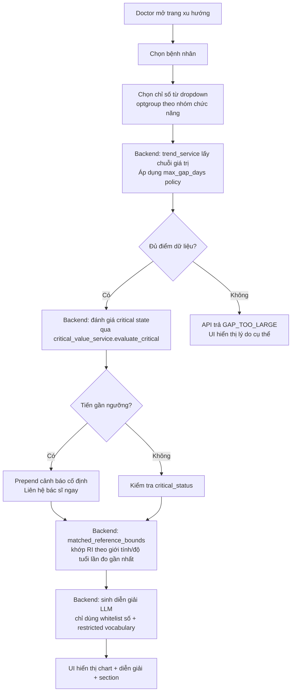
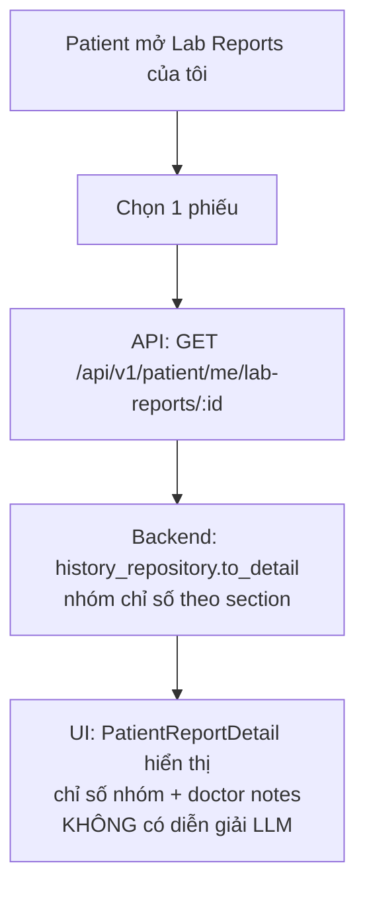

# Feature Handoff — Phân tích xu hướng nâng cao (ADR-010)

## 1. Tổng quan và Mục tiêu

### Tên tính năng và mã dự án
- **Tên tính năng:** Phân tích xu hướng nâng cao (Advanced Trend Analysis)
- **Mã dự án:** P-056
- **Nhánh code:** `feature/advanced-trend-analysis` (chưa merge vào `main`)
- **ADR tham chiếu:** ADR-010 (`docs/adr/adr-010-trend-interpretation-safety-contract.md`) — status **ACCEPTED**, ngày phê duyệt 2026-08-18. Đây là tài liệu tham chiếu chính; mọi thay đổi hành vi của trend service phải đọc ADR này trước.

### Mục tiêu kinh doanh / vấn đề được giải quyết
Nguồn: Business Description `nhan-xet-phan-tich-xh.docx`. Nhóm trưởng đưa ra 3 nhận xét cần đóng trước khi triển khai:

1. **Ranh giới diễn giải dữ kiện vs nhận định y khoa chưa rõ** — chỉ có ví dụ minh họa, chưa có quy tắc cụ thể.
2. **Điểm mù an toàn giữa trend service và pipeline cảnh báo nguy hiểm** — không có đường nối giữa diễn giải xu hướng và `critical_detector` hiện có.
3. **Khoảng tham chiếu chưa phân biệt theo giới tính/độ tuổi** — chưa thấy đề cập.

3 mục tiêu nghiệp vụ tương ứng:
- (1) Gom cụm chỉ số theo nhóm chức năng.
- (2) Nâng cấp diễn giải xu hướng từ mô tả biểu đồ sang giải thích có ngữ cảnh khoảng tham chiếu.
- (3) Hoàn thiện lớp cấu hình chỉ số dùng chung cho persistence và trend policy.

### Tiêu chí hoàn thành (Definition of Done)
- [x] ADR-010 được accept với 6 quyết định CRIT-TREND-01 đến CRIT-TREND-06, xác nhận bằng code fact tại thời điểm viết.
- [x] 4 nhóm chức năng được ánh xạ: `hematology`, `chemistry`, `lipids`, `other`.
- [x] Trend interpretation có ngữ cảnh khoảng tham chiếu theo giới tính/độ tuổi của lần đo gần nhất (snapshot lịch sử, không phải hồ sơ hiện tại).
- [x] Kết nối an toàn với `critical_detector` qua module dùng chung `critical_value_service.py`, có luật "tiến gần ngưỡng" (APPROACH_MARGIN = 10%).
- [x] Guardrail đối kháng được khóa bằng test (allow/deny theo ADR), không còn là ví dụ minh họa suông.
- [x] Cảnh báo liên hệ bác sĩ là văn bản cố định, không qua LLM, hiển thị ở mọi nhánh trả về (kể cả LLM lỗi/fallback).
- [x] Cấu hình chỉ số dùng chung (`indicator_catalog_service.py`) làm facade runtime duy nhất cho metadata, có policy `max_gap_days` theo từng chỉ số.
- [x] 2 endpoint API (`/api/v1/history/{id}` và `/api/v1/patient/me/lab-reports/{id}`) dùng chung `history_repository.to_detail()`.
- [x] Test coverage mới đầy đủ (xem mục 5).

---

## 2. Thiết kế và Giao diện

### Liên kết bản thiết kế
> **Lưu ý:** Tính năng này chủ yếu là nâng cấp backend service + wiring frontend hiện có. Tại thời điểm handoff, **chưa có link Figma cụ thể** cho các thay đổi UI. Các thay đổi giao diện là:
> - Thêm `<optgroup>` nhóm chức năng vào dropdown chọn chỉ số ở trang xu hướng.
> - Trang bệc nhân tự xem phiếu (`PatientReportDetail.tsx`) hiển thị section grouping.
> - Trang lịch sử (`HistoryPanel.tsx`) hiển thị section grouping.
> - Cảnh báo cố định "liên hệ bác sĩ" xuất hiện khi có trạng thái critical/approaching_critical.

Nếu cần, hãy yêu cầu designer cung cấp link Figma cho các màn hình trên.

### Danh sách màn hình và trạng thái

| Màn hình | Trạng thái rỗng | Đang tải | Lỗi | Thành công |
|---|---|---|---|---|
| **Trang xu hướng (Doctor)** | Dropdown chỉ số trống hoặc chưa chọn; chart area trống | Spinner khi fetch trend data | Toast/alert khi API lỗi; fallback text nếu LLM timeout | Hiển thị chart + diễn giải có ngữ cảnh + section grouping |
| **PatientReportDetail.tsx** (Bệnh nhân xem phiếu) | Danh sách chỉ số trống hoặc chưa load | Spinner khi fetch report detail | Error state khi API `/api/v1/patient/me/lab-reports/{id}` lỗi | Danh sách chỉ số được nhóm theo section; **không có diễn giải LLM** (quyết định ADR) |
| **HistoryPanel.tsx** (Bác sĩ/Lịch sử) | Panel trống khi chưa chọn record | Spinner khi load chi tiết | Error boundary khi API `/api/v1/history/{id}` lỗi | Chi tiết phiếu + section grouping + doctor notes |

### Thông số kỹ thuật giao diện
- **Màu sắc/Khoảng cách/Font:** Tính năng này không thay đổi design system. Các thay đổi frontend tuân thủ cấu hình hiện có (`globals.css`, component styles hiện hành).
- **Lưu ý quan trọng:** `globals.css` từng bị `ruff format` đổi line-ending (CRLF→LF) ngoài phạm vi — đã revert thủ công. Không có thay đổi CSS chủ động trong nhánh này.

---

## 3. Luồng người dùng (User Flow)

### Luồng chính: Bác sĩ xem xu hướng chỉ số

### Luồng phụ: Bệnh nhân xem phiếu kết quả

### Xử lý lỗi kết nối / thao tác sai
| Tình huống | Cách xử lý |
|---|---|
| API `/api/v1/history/{id}` lỗi mạng | `HistoryPanel.tsx` hiển thị error boundary + nút thử lại |
| API `/api/v1/patient/me/lab-reports/{id}` lỗi mạng | `PatientReportDetail.tsx` hiển thị error state + retry |
| LLM sinh diễn giải lỗi/timeout | `trend_explanation_service` fallback text vẫn kèm **cảnh báo cố định** (không phụ thuộc LLM) |
| Gap dữ liệu vượt ngưỡng `max_gap_days` | API trả `GAP_TOO_LARGE`, UI hiển thị lý do cụ thể theo chỉ số |
| Reference range không khớp (giới tính/độ tuổi không có RI) | Không đưa ra nhận định "trong khoảng/vượt ngưỡng", chỉ hiển thị % biến động + hướng đi |
| Truy cập trái phép phiếu bệnh nhân khác | Backend phân quyền theo role; endpoint bác sĩ `/api/v1/history/{id}` yêu cầu quyền doctor |

---

## 4. Yêu cầu kỹ thuật và Dữ liệu

### Cấu trúc API, input/output mẫu

**Endpoint 1: Chi tiết lịch sử (Bác sĩ)**
- `GET /api/v1/history/{id}`
- Response schema: `LabReportDetailSchema` (build từ `history_repository.to_detail()`)
- Fields bao gồm: `report_indicators` (đã có `indicator_catalog_id`, `section`), `abnormal_count`, `source`, `reviewed_by_doctor`, `doctor_notes`.

**Endpoint 2: Chi tiết phiếu bệnh nhân**
- `GET /api/v1/patient/me/lab-reports/{id}`
- Response schema: `LabReportDetailSchema` (dùng chung `repo.to_detail()`)
- Lưu ý: endpoint này cũng trả `doctor_notes` — không phải lỗ hổng mới, hành vi này vốn đã có ở `/api/v1/history/{id}` từ trước.

**Endpoint 3: Trend interpretation**
- Input: chỉ số canonical name, danh sách giá trị lịch sử, `patient_gender_at_test`, `patient_age_at_test` của lần đo gần nhất.
- Output: `TrendResponse` gồm:
  - `critical_status`: `normal` / `critical` / `approaching_critical`
  - `approaching_critical`: boolean
  - `section`: nhóm chức năng
  - `interpretation`: text diễn giải (hoặc fallback nếu LLM lỗi)
  - `reference_bounds`: object chứa `low`/`high`/`unit` (nếu khớp được RI)
  - `percent_change`: số float (backend tính, model chỉ lặp lại)

### Quy tắc logic nghiệp vụ và phân quyền

| Quy tắc | Mô tả | Nguồn |
|---|---|---|
| **Section grouping** | 4 nhóm: `hematology` (Huyết học), `chemistry` (Sinh hóa thận-gan), `lipids` (Mỡ máu & đường huyết), `other` (Khác). Fasting plasma glucose được override từ Chemistry → Lipids do nhóm sản phẩm. | ADR CRIT-TREND-06 |
| **Reference range matching** | Khớp RI qua `ReferenceRepository.select_rule()` dùng `patient_gender_at_test` / `patient_age_at_test` của lần đo gần nhất (snapshot lịch sử). Không khớp được → không đưa ra nhận định "trong khoảng/vượt ngưỡng". | CRIT-TREND-01/02 |
| **Critical evaluation** | Chỉ 2/9 chỉ số có ngưỡng active (Fasting plasma glucose, Potassium). Luật "tiến gần ngưỡng": chưa critical + đang di chuyển về phía ngưỡng + nằm trong 10% biên độ ngưỡng (`APPROACH_MARGIN = 0.10`). | CRIT-TREND-03 |
| **Max gap policy** | Duyệt ngược từ điểm mới nhất, chỉ giữ block liên tục cho tới gap đầu tiên vượt ngưỡng. `null` trong config tắt policy. Nếu còn dưới 3 điểm sau lọc → API trả `GAP_TOO_LARGE`. | `reference_checker_config.json::trend_max_gap_days` |
| **Guardrail trend** | Whitelist số có kiểm soát (range bounds, critical bounds, % biến động — backend tính và cấp). Blacklist từ vựng: dự đoán tương lai, suy diễn nguy cơ, khuyến nghị xét nghiệm/thăm khám thêm. Cảnh báo liên hệ bác sĩ là văn bản cố định, không qua LLM. | CRIT-TREND-01/04/05 |
| **Phân quyền** | Doctor: xem đầy đủ trend + diễn giải LLM. Patient: xem report detail + section grouping, **không có diễn giải LLM** (tránh chi phí/độ trễ và trùng lặp nội dung). | ADR CRIT-TREND-06 |

### Thư viện / công cụ mới cần bổ sung
- **Không có thư viện mới** trong nhánh này. Tất cả thay đổi dùng thư viện/cấu trúc hiện có.
- Công cụ phát triển đã dùng: `ruff` (lint/format), `pytest`, `EMBEDDING_PROVIDER=disabled` để chạy test local.
- **Lưu ý:** `mypy` không có sẵn trong venv (`No module named mypy`). Makefile target `check` thực ra chỉ chạy `lint format test` (không gồm `typecheck`). Cần cài lại nếu team yêu cầu typecheck trước merge.

### Cấu trúc dữ liệu chính

| File | Vai trò |
|---|---|
| `data/reference/reference_ranges.json` | Clinical ranges + provenance theo `sex`/`age_scope`. Section được propagate từ CSV nguồn khi build (`build_reference_config.py`). |
| `data/reference/reference_checker_config.json::trend_max_gap_days` | Policy `max_gap_days` theo từng chỉ số approved. Hiện toàn bộ `null` (chờ PO duyệt). |
| `data/reference/units_metric.csv` | Standard unit source. |
| `src/services/indicator_catalog_service.py` | Facade runtime duy nhất cho metadata chỉ số: canonical name, aliases, canonical unit, functional section, `max_gap_days`. |
| `src/services/analyte_sections.py` | Đọc `reference_ranges.json`, suy ra section runtime (không lưu DB). |
| `src/services/critical_value_service.py` | Module thuần dùng chung: `evaluate_critical()`, `approaches_critical()`. |
| `src/services/trend_explanation_service.py` | Sinh diễn giải xu hướng có guardrail, prepend cảnh báo cố định nếu có critical/approaching. |
| `src/services/trend_service.py` | Orchestrate trend: lấy dữ liệu, áp dụng max_gap_policy, đánh giá critical state, gọi explanation. |

---

## 5. Kế hoạch kiểm thử (Testing)

### Các kịch bản kiểm thử chính (Test Cases)

| # | Kịch bản | File test | Số case | Mô tả |
|---|---|---|---|---|
| 1 | Critical value evaluation | `tests/test_services/test_critical_value_service.py` | 14 | `evaluate_critical`/`approaches_critical` trực tiếp, không qua AgentState/pipeline. |
| 2 | Analyte section mapping | `tests/test_services/test_analyte_sections.py` | 7 | Kiểm tra 4 nhóm chức năng, override FPG → lipids. |
| 3 | Trend explanation guardrail (đối kháng) | `tests/test_services/test_trend_explanation_guardrail.py` | 13 | Khoá từng câu allow/deny của ADR CRIT-TREND-01. Kiểm tra restricted vocabulary và whitelist số. |
| 4 | Integration: trend qua HTTP | `tests/test_api/test_patient_trends.py` | — | Critical wiring, escalation notice, prompt mang reference range, guardrail chặn từ vựng mới, section trong report detail, FK catalog, max-gap policy, GAP_TOO_LARGE response. |
| 5 | Frontend grouping helper | `frontend/src/lib/trendUi.test.mjs` | 4 | `groupBySection()` đúng với 9 analyte approved. |
| 6 | Indicator catalog contract | `tests/test_services/test_indicator_catalog_service.py` | — | Metadata 9 analyte, alias resolution, coverage adult male/female, coverage config policy. |
| 7 | Critical detector regression | `tests/test_agents/test_critical_detector_node.py` | 79 | Toàn bộ pass không sửa 1 assertion nào sau refactor gọi `evaluate_critical()`. |

### Các thiết bị / trình duyệt cần kiểm tra
- **Trình duyệt:** Chrome/Firefox/Safari mới nhất (dev environment). Tính năng không có thay đổi responsive đặc biệt ngoài `<optgroup>` trong dropdown, đã kiểm tra trên viewport tiêu chuẩn.
- **Thiết bị:** Desktop (doctor workflow), Mobile/Tablet (patient report view) — `PatientReportDetail.tsx` và `HistoryPanel.tsx` đã responsive từ trước, nhánh này chỉ thêm section grouping.
- **Môi trường test:** Chạy `pytest` với `EMBEDDING_PROVIDER=disabled` (cần thiết để chạy local, xem mục Vấn đề còn mở).

---

## 6. Quyết định kỹ thuật đã chốt

- **Không thêm cột `section` vào `IndicatorCatalog`** — section được suy ra runtime từ `reference_ranges.json` qua `analyte_sections.py`, không lưu DB.
- **Trang bác sĩ/report-detail chỉ hiển thị section, KHÔNG có diễn giải LLM** — quyết định có chủ đích (ADR CRIT-TREND-06), tránh chi phí/độ trễ và nội dung trùng lặp.
- **Hợp nhất 2 code path xây `LabReportDetailSchema`** — cả `/api/v1/history/{id}` và `/api/v1/patient/me/lab-reports/{id}` giờ dùng chung `history_repository.to_detail()`.
- **`max_gap_days` là policy dữ liệu, không phải suy luận y khoa** — engine sẵn sàng, nhưng tất cả đang `null` chờ PO/clinical owner duyệt.
- **Import `glucose_mmol_l_to_mg_dl`, `compare_critical`, `load_critical_thresholds` trong `critical_detector_node.py` phải giữ** dù không gọi trực tiếp — bị `ruff check --fix` xoá nhầm trong lúc dọn lint, làm vỡ 21/79 test do monkeypatch. Đã khôi phục kèm `# noqa: F401`.

---

## 7. Vấn đề còn mở / Rủi ro

- **Nguồn cấu hình tách theo trách nhiệm** — facade là entry point runtime duy nhất, nhưng clinical ranges/provenance vẫn ở 3 nơi: `reference_ranges.json`, `reference_checker_config.json`, `units_metric.csv`. Nếu product muốn 1 manifest vật lý duy nhất để authoring chỉ số mới, cần migration dữ liệu có review y khoa.
- **`age_scope` chỉ có 1 bracket (`Adult`, 18–60)** — khớp nhóm bệnh nhân mục tiêu của PRD, không phải bug. Mở rộng pediatric/elderly cần bổ sung RI data rồi chạy audit.
- **Ngưỡng `max_gap_days` chưa được PO/clinical owner duyệt** — engine và validation sẵn sàng, nhưng tất cả đang `null`; không đặt mặc định để tránh cắt chuỗi trend không có căn cứ.
- **Chưa chạy `mypy`** — công cụ không có sẵn trong venv. Makefile target `check` thực ra chỉ là `lint format test` (không gồm `typecheck`). Không chặn merge nhưng nên cài lại nếu team cần.
- **18 test thất bại trong `pytest tests/` full run — toàn bộ pre-existing, không liên quan nhánh này**:
  - 17 test ở `tests/test_eval/test_ragas_*.py` fail vì thiếu package `langchain_community`.
  - 1 test `tests/test_data/test_explanation_reference_sync.py::test_sync_20_ragas_unchanged` fail vì hash SHA-256 pin cứng của `eval/datasets/ragas_v2_baseline.jsonl` không khớp.
  - Cả 2 file liên quan không nằm trong diff nhánh, xác nhận qua `git status`/`git log`. Cần người biết rõ eval infra xác nhận lại.
- **`ruff format` một lần đã format lại 65 file ngoài phạm vi** — đã revert thủ công về đúng phạm vi diff. Nếu chạy lại `ruff format src/ tests/` không giới hạn path sẽ tái diễn.
- **Chưa commit** — toàn bộ thay đổi đang ở working tree của `feature/advanced-trend-analysis`, chưa `git add`/`git commit`.

### Rủi ro cho version tiếp theo
- Nếu registry `critical_thresholds.json` mở rộng thêm chỉ số ngoài glucose/potassium, cơ chế "tiến gần ngưỡng" sẽ tự áp dụng (vì `_latest_critical_state()` không hardcode tên chỉ số), nhưng biên 10% chưa chắc phù hợp lâm sàng cho chỉ số khác — cần review riêng.
- `matched_reference_bounds()` gọi `get_reference_repository()` (singleton `lru_cache`) mỗi lần sinh diễn giải — nếu nạp lại reference data lúc runtime (hot reload), cache không tự invalidated, giống pattern đã có sẵn ở `reference_range_checker_node.py`.
- Khi mở rộng catalog, bản ghi cấu hình **bắt buộc giữ cấu trúc per-rule theo `sex`/`age_scope`** — nếu đơn giản hoá thành "1 chỉ số = 1 khoảng tham chiếu" sẽ tái tạo đúng lỗi nhận xét #3 của nhóm trưởng.

---

## 8. PLO đã chạm

- **An toàn & Đạo đức AI** — Rất sâu: đóng 3 lỗ hổng bằng cơ chế kiểm chứng (module dùng chung, luật "approach" tường minh, whitelist số có nguồn gốc rõ ràng, cảnh báo cố định không phụ thuộc LLM).
- **Kiến trúc & Framework AI** — Sâu: tách logic ngưỡng nguy kịch thành module thuần dùng chung giữa LangGraph node và service độc lập, không tạo coupling hai chiều.
- **Giám sát & Đánh giá** — Có: bộ test đối kháng viết trước khi chỉnh guardrail.

---

## 9. Việc ưu tiên cho version tiếp theo

1. Xin PO/clinical owner duyệt `max_gap_days` theo từng chỉ số trước khi bật lọc khoảng cách thời gian.
2. Nếu cần authoring chỉ số mới qua 1 manifest vật lý duy nhất, thiết kế migration dữ liệu thay vì duplicate RI rule/provenance.
3. Cài lại `mypy` trong venv nếu cần typecheck trước khi merge.
4. Xác nhận lại 18 test fail pre-existing (ragas eval infra + hash pin) không phải regression thật trước khi merge nhánh vào `main`.
5. Review và commit — nhánh hiện chưa có commit nào cho toàn bộ khối việc này.
